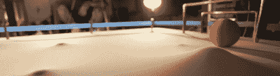

# Morphield 是一个热乱七八糟的布线，也真的很酷

> 原文：<https://hackaday.com/2012/07/26/morphield-is-a-hot-mess-of-wiring-also-really-cool/>

如果你错过了 MB Labs 上周日晚上为红牛创作大赛进行的项目演示，[描述他们构建的页面](http://creation.redbullusa.com/#/?page=MBLabs)已经出现，并在 Hackaday 上给了我们一个机会。

Morphield 由一块伸展在框架上的织物组成，它本身隐藏了 135 个螺线管控制的气球，这些气球移动场地，而不是通过移动球来踢足球。这些螺线管由 wiimote 控制，允许玩家操纵场地地形，并有希望将球引导到对手的球门。

除了为 Hackaday 自己的 *[《弥诺陶洛斯的复仇》](http://creation.redbullusa.com/#/?page=Hackaday)，* MB Labs 还发布了一个 Arduino 库和一个 API，这样 Morphield 就可以重新用于其他游戏、动态艺术装置，以及——我们希望——一个巨大、柔软版本的[艺术展示](http://en.wikipedia.org/wiki/Pin_Art)。

当 MB Labs 的 Morphield 的内脏在红牛创造直播流上展示时，聊天窗口中出现的唯一单词是“哇”、“天哪”和“太棒了”。我们必须达成一致。这些家伙一起做了一个非常酷的游戏，一旦创作比赛结束，这个游戏也将结束。