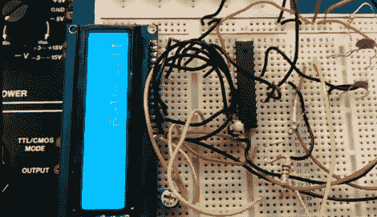

# 莫尔斯电码解释器

> 原文：<https://hackaday.com/2012/05/11/morse-code-interpreter/>

苏莱曼·哈布希和两个同学在苏丹卡布斯大学设计了一个莫尔斯电码翻译器。该系统使用麦克风收听莫尔斯电码信号，然后将该输入翻译成文本，显示在字符 LCD 上。

该试验电路板电路通过运算放大器将麦克风的音频信号馈入 ATmega8 微控制器的 ADC。捕获的信号以特殊的方式存储为一个字节。三个最低有效位表示字符中总共包含多少个点或破折号，其余位用 0 和 1 表示这些点和破折号。这个过程的完整描述包含在上面文章链接的 PDF 中。正如您在休息后的视频中看到的，一旦收到完整的消息，硬件就会等待处理所有的信号。

这将是一个伟大的附加为莫尔斯电码练习键盘。

[https://www.youtube.com/embed/6X8iZJpLC2c?version=3&rel=1&showsearch=0&showinfo=1&iv_load_policy=1&fs=1&hl=en-US&autohide=2&wmode=transparent](https://www.youtube.com/embed/6X8iZJpLC2c?version=3&rel=1&showsearch=0&showinfo=1&iv_load_policy=1&fs=1&hl=en-US&autohide=2&wmode=transparent)