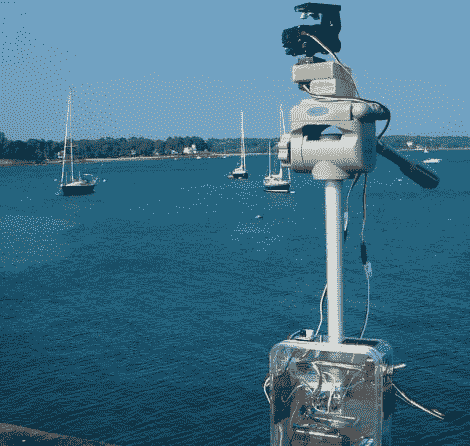

# 电动相机架使全景拍摄变得简单

> 原文：<https://hackaday.com/2012/07/24/motorized-camera-rig-makes-panoramic-shooting-simple/>

在一些人可能会看到一堆垃圾的地方，普通读者和精打细算的照片迷(FantomFotographer)看到了灵感。他在寻找一个可以帮助他拍摄更好的全景照片的装置，并找到了在他身边建造一个装置所需要的一切。

他有一个旧三脚架，作为钻机的基础。顶部有一对伺服系统[FantomFotographer],用一些碎木头、螺丝和胶水固定在三脚架上。伺服系统由 Arduino Nano 驱动，它舒适地坐在他从垃圾堆中捡来的塑料外壳中。他使用红外接收器来控制整个事情，这使他不仅可以改变拍摄角度，还可以改变相机设置。

虽然听起来他的升级摄影设备一切都很好，但[FantomFotographer]说，像每个项目一样，还有一些改进的空间。他目前对源代码保密，但是一旦他觉得一切正常，他说他会发布的。

与此同时，一定要看看他收集的很酷的全景照片。