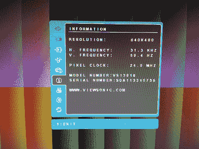

# 将 FPGA 项目从 VGA 转移到 DVI-D

> 原文：<https://hackaday.com/2012/08/03/moving-an-fpga-project-from-vga-to-dvi-d/>

使用简单的 R/2R DAC，用 FPGA 创建 VGA 相当容易。正如[Mike]指出的，这需要大量的 IO 引脚，而很多开发板只支持 8 位 VGA。如今，许多设备上的模拟 VGA 正在被 DVI-D 和 HDMI 取代，因此将项目从 VGA 移植到 DVI-D 会很好。

为了解决这个问题，他想出了一个简单的用 VHDL 语言实现的 DVI-D。结果将 VGA 的 RGB 和 sync 数据转换为 DIV-D。由于 DVI-D 和 HDMI 使用相同的视频信号，因此可以连接到显示器或电视的输入端。

该实现显示了在 [Pipistrello](http://hamsterworks.co.nz/mediawiki/index.php/Pipistrello "Pipistrello") 开发板上显示的测试模式，该开发板采用 Spartan 6 LX45 FPGA，但该项目旨在移植到其他供应商的 FPGA。有了正确的连接器和足够快的时钟速度，这个项目应该有助于从 8 位 VGA 项目转移到辉煌的 32 位彩色。