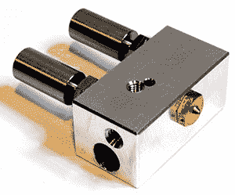

# MRRF:热端、挤压机、极度时髦的英国人和坚忍的瑞典人

> 原文：<https://hackaday.com/2015/03/25/mrrf-hot-ends-extruders-extremely-posh-brits-and-stoic-swedes/>

就中西部说唱音乐节的地点而言，这并不理想。这是一个特性，而不是一个 bug，它意味着只有酷的人才会出来参加这个活动。有几个人穿越数千英里的海洋，只是为了炫耀他们建造的一些很酷的东西。

## 两种颜色，一个喷嘴

来自 E3D 的[桑杰]和[乔希]从古老快乐的英国远道而来，展示他们的一些商品。他们展览的明星是[独眼巨人挤出机](http://e3d-online.com/Multi-Extrusion/Cyclops)，一个双挤出热端，两个输入，一个输出。是的，一个喷嘴可以喷出两种颜色。

如果你看到一台打印机被宣传为双挤压，你会得到两个挤压机和两个热端。这是一种笨拙的做事方式——优雅的解决方案是从一个喷嘴中喷出两种颜色。

来自 E3D 的家伙们展示了他们的独眼巨人喷嘴的一些照片，包括一只黑色和红色的箭毒蛙，和一只蓝色和白色的章鱼。这些照片看起来很棒，完全符合你对双色照片的预期。

有传言说，独眼巨人的发展涉及挤压两种颜色，冷冻喷嘴，并把它放在轧机只是为了看看颜色如何混合。我没有看到那些照片，但有很多工作进入这个热点结束。

## 两台挤出机的功率

bondtech.se 的马丁从瑞典远道来到 MRRF。他在那里炫耀[他的新挤压机](http://www.bondtech.se/?page_id=8)。

挤出机使用普通的步进电机，但不是通常的滚花或螺纹进料轮和轴承来推动细丝，而是使用两个连接到行星齿轮系统的反向旋转进料轮。这是一个很大的扭矩，不会扭曲或剥离灯丝。当你考虑到所有即将出现的怪异细丝——ninjaflex，甚至 3D 打印可加工蜡细丝，这是非常有趣的。

即使你的细丝直径不是 1.75 或 3 毫米，这种设置仍然可以可靠地推动塑料；有一个螺栓可以将其中一个进给轮移进移出 0.4 毫米

[Martin]将他的一对挤压机连接到一个应变仪上，它的强度足以将你的打印机从桌子上提起，而不会剥离细丝。这里有一段来自 bondtech 页面的演示视频。