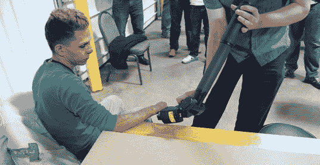

# MRRF:圆桌会议和综述

> 原文：<https://hackaday.com/2014/03/20/mrrf-roundtable-and-roundup/>

上周末，哈卡戴去印第安纳州歌珊市参加中西部说唱节。我们遇到了很多有趣的人，看到了很多很酷的东西，并设法避开了在歌珊周围道路上行驶的阿米什马和马车。

我们已经发布了一些来自 MRRF 的东西，包括【乔丹·米勒】和他的公司在生物打印方面的[冒险](http://hackaday.com/2014/03/18/mrff-3d-bioprinting/)，一个非常酷的[可打印对象回购，由一个非营利的 LLC](http://hackaday.com/2014/03/17/mrrf-repables-the-nonprofit-3d-object-repository/) 支持，一些来自 Lulzbot 的[东西，包括一个新的挤压机，弹性细丝，以及正在开发的 3D 扫描仪的消息，](http://hackaday.com/2014/03/17/mrrf-stuff-from-lulzbot/)[基于 ARM 的 CNC 控制器](http://hackaday.com/2014/03/17/mrrf-arm-based-cnc-controllers/)，包括光滑的滑板和喙骨的斗篷， [3D 打印树脂模具](http://hackaday.com/2014/03/16/mrrf-3d-printed-resin-molds/)这真的是一个令人惊叹的事件，也是地球上最大的 DIY 3D 打印机大会。谁也不知道这是如何在印第安纳州的歌珊发生的，但是我们想对组织这次活动的 SeeMeCNC 表示感谢。

这么多著名的 RepRappers 聚集在一个地方，就 RepRap、3D 打印机和微加工的现状举行一次圆桌讨论是有意义的。我们有一个 40 分钟长的视频，休息后你可以看看。

[https://www.youtube.com/embed/fhj9GLN8X-0?version=3&rel=1&showsearch=0&showinfo=1&iv_load_policy=1&fs=1&hl=en-US&autohide=2&wmode=transparent](https://www.youtube.com/embed/fhj9GLN8X-0?version=3&rel=1&showsearch=0&showinfo=1&iv_load_policy=1&fs=1&hl=en-US&autohide=2&wmode=transparent)

上面的视频是与 [Ultimachine](https://ultimachine.com/) 的【约翰尼·鲁塞尔】，RAMPS 和 [RAMBo](http://reprap.org/wiki/RAMBo) 电子板的开发者， [Prusa Mendel](http://reprap.org/wiki/Prusa_Mendel) 和 [i3](http://reprap.org/wiki/I3) fame 的【Prusa】， [Maker's Tool Works](http://www.makerstoolworks.com/) 的【Mike】A . k . A【max bots】和 [MendelMax 2](http://reprap.org/wiki/MendelMax_2) 的开发者，[的机器人心理学家【Aeva】的问答环节毫不夸张地说，这些家伙参与了 90%的新闻报道。](http://www.lulzbot.com/)

我们强烈建议喝杯咖啡，在新的标签页打开视频。他们四个人之间有一些很棒的评论，还有一些观众非常有见地的问题。以下是被问到的问题列表:

*   开源和廉价克隆的经济学是什么？
*   RepRap 社区今年将何去何从？
*   公司应该如何激励不那么吸引人的项目？
*   3D 打印我们什么时候能得到功能性的机械零件？
*   有哪些关于减法制造工具链的建议？
*   RepRap 在全球哪里受欢迎？
*   SLS 专利到期会怎么样？
*   你是如何开始的，新人如何能有所贡献？
*   RepRap 能无限抵挡 DRM 吗？
*   开源 3D 建模程序有哪些推荐？

同样在 MRRF 的还有 mUVe 3D，[一个非常酷的树脂打印机](http://www.muve3d.net/press/)的制造商，也是 RepRap 社区中唯一看到 coroplast 在他们的机器上制造非结构面板的人。我们还抓到了他们的视频:

[https://www.youtube.com/embed/e_uL866-sxA?version=3&rel=1&showsearch=0&showinfo=1&iv_load_policy=1&fs=1&hl=en-US&autohide=2&wmode=transparent](https://www.youtube.com/embed/e_uL866-sxA?version=3&rel=1&showsearch=0&showinfo=1&iv_load_policy=1&fs=1&hl=en-US&autohide=2&wmode=transparent)

* * *

我们再一次感谢所有到场的人，感谢 SeeMeCNC 组织了这次活动，感谢 Makers Tool Works for 3D printed waffle irons，以及所有前往歌珊参加世界上最大的 RepRaps 大会的人。

如果你没看出来，这里有一些由[菲尔·布里斯基]和他的小型四轴飞行器提供的航拍镜头。一定要看看 5 英尺乘 8 英尺的快乐扳手旗，我们现在正在考虑把它放在一个 Hackaday 商店里。希望明年能在那里见到你！

[https://www.youtube.com/embed/oFTkrxLU_VQ?version=3&rel=1&showsearch=0&showinfo=1&iv_load_policy=1&fs=1&hl=en-US&autohide=2&wmode=transparent](https://www.youtube.com/embed/oFTkrxLU_VQ?version=3&rel=1&showsearch=0&showinfo=1&iv_load_policy=1&fs=1&hl=en-US&autohide=2&wmode=transparent)

    This man was on the cover of Forbes magazine          A vertical H-bot  Rules for the venue. No beer kegs *on the carpet*.    Custom waffles.           