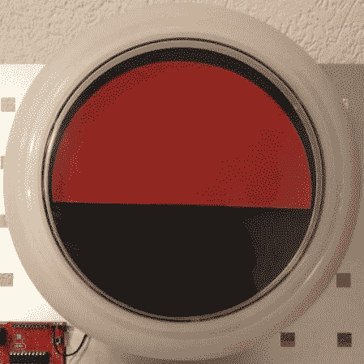

# 基于 MSP430 的 CTF 硬件黑客挑战赛

> 原文：<https://hackaday.com/2014/04/02/msp430-based-ctf-hardware-hacking-challenge/>

黑客会议通常以“夺旗”或“CTF”活动为特色。通常，这是一个软件黑客挑战，涉及闯入为活动设置的目标，并捕获它们。这是好的，合法的，黑客乐趣。

然而，一些人也开始构建涉及硬件黑客的 CTF。[Balda]最近的[硬件黑客挑战](http://www.balda.ch/posts/2014/Apr/01/ins14-life-is-even-harder/)是为 2014 年 CTF[失眠黑客](http://insomnihack.ch/)打造的。它使用 MSP430 作为目标设备，用户可以通过一个[总线盗版](http://dangerousprototypes.com/docs/Bus_Pirate)通过 UART 向设备输入命令。拉下漏洞，轮子旋转显示一面旗帜。

在第一项挑战中，参赛者必须反编译固件并找到一个模糊的密码。第二个挑战有点复杂。密码检查函数使用 memcpy，这使得它容易受到缓冲区溢出攻击。通过重写程序计数器，就有可能接管程序的控制权并使标志转向。

memcpy 的风险让我们想起了这组[海报](http://natashenka.ca/posters/)。只有戒掉 memcpy 才能 100%保护你不被溢出和内存泄露！