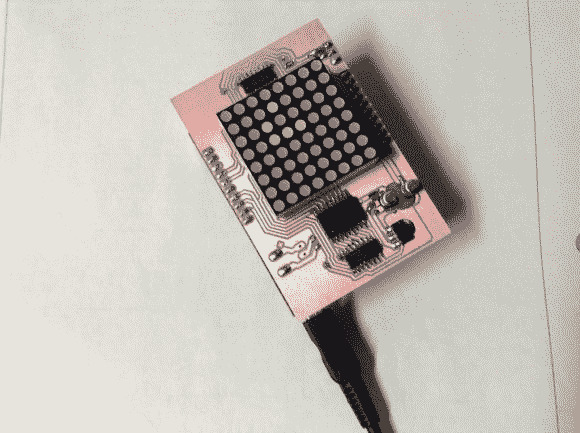

# MSP430 Launchpad 游戏的生命之盾

> 原文：<https://hackaday.com/2012/11/19/msp430-launchpad-game-of-life-shield/>

[100uf] [为 MSP430 launchpad](http://www.reddit.com/r/electronics/comments/13ezye/finally_got_around_to_finishing_the_game_of_life/) 建造了 LED 矩阵屏蔽。他的设计目标是让它玩康威的生活游戏。它就是这样做的，正如你在休息后的视频中看到的。不过就是等着多学点花样。在他厌倦了观看细胞自动机之后，他可以尝试制作一些 [LED 吊灯动画](http://hackaday.com/2012/10/12/led-matrix-pendants/)。

正如你所知，这块板是在他的家庭作坊里制作的。它不是蚀刻的，而是使用本图库中显示的数控机床[铣削的。这是一个单面 PCB，非常适合表面贴装元件和朝下的引脚插座。但我们想知道焊接 8×8 LED 矩阵的引脚有多难。它的每个角落都有塑料脚，作为支撑物，将车身与铜层分开。但它看起来仍然像是一个狭小的空间，他需要把他的熨斗和一些焊料放进去。](http://imgur.com/a/1Frpz)

[https://www.youtube.com/embed/DpaEVw45fBY?version=3&rel=1&showsearch=0&showinfo=1&iv_load_policy=1&fs=1&hl=en-US&autohide=2&wmode=transparent](https://www.youtube.com/embed/DpaEVw45fBY?version=3&rel=1&showsearch=0&showinfo=1&iv_load_policy=1&fs=1&hl=en-US&autohide=2&wmode=transparent)

[via [Reddit](http://www.reddit.com/r/geek/comments/13f0cc/conways_game_of_life_on_the_msp430_launchpad_a/)