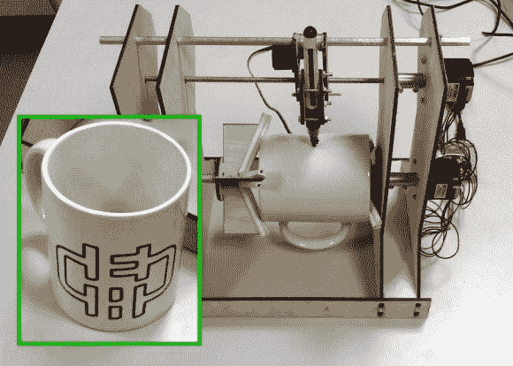

# 基于 Egg-Bot 的马克杯绘图仪

> 原文：<https://hackaday.com/2013/03/15/mug-plotter-based-on-the-eggbot/>

这里有一个有趣的方法来打破老格子间农场的单调。马克杯绘图仪将让你[熟练地在你的咖啡杯](http://www.instructables.com/id/Mug-Plotter)上为一周的每一天刻上不同的妙语或设计。如果它看起来很熟悉，那是因为它大致基于非平面绘图机器人[的蛋机器人](http://hackaday.com/2010/03/30/cnc-egg-decorating/)。

[Teed]使用激光切割胶合板零件制造了这台机器。他从抓取技术开始构建描述。这个有两个部分，一个是凹的，适合杯子的嘴。凸面抓住它的底部边缘。这些部件与固定唱针的滑杆和螺纹杆一起放在框架上。一个伺服电机是沿着乘坐，提供了必要时取消标记的能力。

你可以在休息后的视频中看到，当其中一个踏步机开始快速转动时，钻机会有一点振荡。但是好像一点都不太影响设计的样子。

[https://www.youtube.com/embed/WYG3ygbObis?version=3&rel=1&showsearch=0&showinfo=1&iv_load_policy=1&fs=1&hl=en-US&autohide=2&wmode=transparent](https://www.youtube.com/embed/WYG3ygbObis?version=3&rel=1&showsearch=0&showinfo=1&iv_load_policy=1&fs=1&hl=en-US&autohide=2&wmode=transparent)