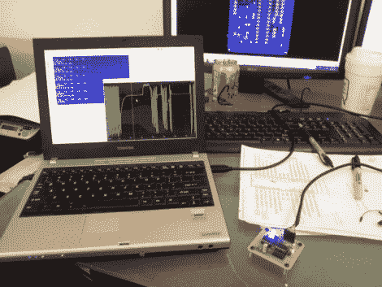

# 多通道模拟输入模块是许多项目的良好起点

> 原文：<https://hackaday.com/2012/06/19/multi-channel-analog-input-module-is-a-good-jumping-off-point-for-many-projects/>

[Scott Harden]已经完成了一些测量模拟输入的项目。但是他有更多的计划，想要一个绘制模拟信号的基础系统。你可以看到他的笔记本电脑旁边的小电路板，它能够采样多达 6 个信号，并通过 USB 将其推送到 PC。

ATmega48 和一些支持元件都在那块板上。USB 连接由 FTDI 电缆负责。他走这条路是因为电缆相对便宜，容易获得，并且在所有主要的操作系统上都有驱动程序支持。如果你看屏幕，你可以看到一个窗口，实时显示一个模拟输入。他用 Python(这又是一个跨平台的工具)写了这个，一次画出所有六个输入没有问题。

作为对[Scott 的] [心电图机](http://hackaday.com/2009/08/22/collect-and-analyze-ecg-data/)的升级，这是非常有用的。他的未来计划包括脉搏血氧计、脑电图和脑电图。