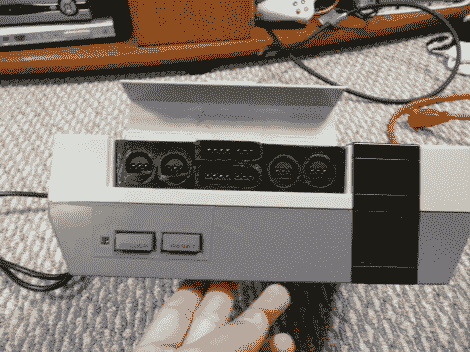

# 多系统任天堂模拟器使用股票控制器

> 原文：<https://hackaday.com/2012/06/19/multi-system-nintendo-emulator-uses-stock-controllers/>

WoolyDawg5 暑假的第一个月是[开发一个任天堂模拟器来统治他们](http://imgur.com/a/SJZLn#0)。他认为没有什么比在原来的控制器上玩游戏更好的了，我们 100%同意他的观点。在这里，您可以看到 NES 机箱上的盒式磁带门隐藏了他需要的额外连接器。

随着门关闭，这看起来像一个股票控制台，但只有从前面。如果你看看它的背面，你就会明白他是如何做到的。有一个 Zotac 主板，它的 I/O 面板安装在背面。它负责为 NES、SNES 和 GameCube 游戏机模拟游戏——我们确信它可以做得更多，但这包括这里看到的控制器端口。每个端口都连接到一个 USB 控制器模块。这些模块的电缆从机箱背面引出，插入主板的 I/O 面板。主板上有 WiFi，这就是[WoolyDawg]用来配置的，通过隧道连接到操作系统，而不是连接键盘或鼠标。

当然，你可以把所有原始的控制台硬件塞进一个包里来完成这样的事情。

[感谢 KoldFuzion]