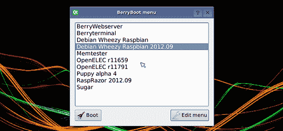

# 多根树莓皮

> 原文：<https://hackaday.com/2013/02/24/multibooting-the-raspberry-pi/>

我们中那些双引导 Linux、Windows 和 OS X 操作系统已经有一段时间的人将会熟悉 GRUB 之类的引导加载程序。然而令人惊讶的是，我们还没有看到去年最受欢迎的电脑——树莓派的引导程序。树莓派有一个引导程序是有意义的；随着来自 Raspbian、Occidentalis 的几十个不同的发行版，以及一堆更深奥的发行版，我们很惊讶我们现在才看到一个合适的 Raspi 引导程序。

Berryboot 安装非常简单——只需将其复制到 FAT 格式的 SD 卡上，就可以在您的 Raspberry Pi 上安装多个操作系统。启动时，Berryboot 会显示一个对话框，显示所有已安装的操作系统，新的操作系统可以通过 Berryboot 菜单在互联网上安装。

你可以在 gits 上抓住 Berryboot [。Berryboot 也可以与那些](https://github.com/maxnet/berryboot)[全奖得主 A10 单板计算机](http://www.allwinnertech.com/en/product/A10.html)一起工作，但是 Hackaday tip line 还没有看到这些板的任何踪迹。