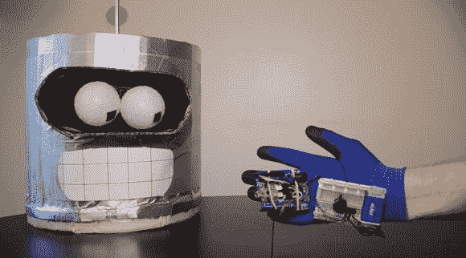

# 音乐挑战让你拍打手腕发出声音

> 原文：<https://hackaday.com/2013/02/02/music-challenge-has-you-flapping-your-wrist-to-make-sounds/>

这个[手套控制器可以让你玩音乐游戏](http://www.instructables.com/id/Arduino-Play-The-Piezo/)。挑战是以正确的节奏执行正确的手腕动作，播放 Pixies 的歌曲*的前奏。这一点在休息后的视频剪辑中有所展示。*

我们经常在手套项目的手指上看到 [flex 传感器，但这款使用的是加速度计。该模块与用于回放的压电蜂鸣器一起固定在他手背上的小试验板上。橡皮筋将 Arduino 连接到他的第三和第四个手指上。速度和节奏是预编程的，但产生的音调是基于每个音符开始时的重力读数。如果你的手没有正确放置，就会弹出错误的音调。](http://hackaday.com/2011/11/07/wireless-midi-piano-glove/)

代码发布在顶部的链接中。当一个被黑的西蒙说游戏时，看到这种改变会很有趣。

[https://www.youtube.com/embed/XR8-zOhIBHI?version=3&rel=1&showsearch=0&showinfo=1&iv_load_policy=1&fs=1&hl=en-US&autohide=2&wmode=transparent](https://www.youtube.com/embed/XR8-zOhIBHI?version=3&rel=1&showsearch=0&showinfo=1&iv_load_policy=1&fs=1&hl=en-US&autohide=2&wmode=transparent)