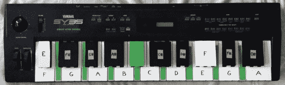

# 音乐家在预算 MIDI 低音踏板

> 原文：<https://hackaday.com/2014/02/03/musician-on-a-budget-midi-bass-pedals/>

风琴踏板已经存在很久了——它们是在演奏钢琴、风琴甚至吉他时进行多任务处理的一种简单方式。[Ville]玩电吉他，想尝试一下低音踏板——唯一的问题是，商业版本相当昂贵。所以他决定用他身边的一个旧 MIDI 键盘做一个自己的临时解决方案。

这种方法的美妙之处在于它是完全非破坏性的——尽管你可能会发现你非常喜欢它，以至于不想把它拆开！[Ville]从用绿色纸板标出间隔键开始。然后，他用胶带和聚苯乙烯片将其他钥匙组合在一起，这些胶带和聚苯乙烯片是他从塑料垃圾箱中回收的。然后，他用音符的范围标记出每组键，以编程到 MIDI 接收器中——在 49 键键盘上，你可以得到比低音踏板键多一个八度音阶的键！在你得到一个合适的风琴踏板单元之前，它肯定会起作用。

从那以后，只需要在软件端重新映射按键，并禁用其他未使用的按键。他提供了一些不同的方法来做到这一点，包括使用 VST 插件和纯数据——他提供了一个他制作的补丁来简化这个过程。

为了看到它的实际效果，请在休息后留下来，听听[Ville]用电吉他倒着弹一个小时。

[https://www.youtube.com/embed/LR8yq-pPgmc?version=3&rel=1&showsearch=0&showinfo=1&iv_load_policy=1&fs=1&hl=en-US&autohide=2&wmode=transparent](https://www.youtube.com/embed/LR8yq-pPgmc?version=3&rel=1&showsearch=0&showinfo=1&iv_load_policy=1&fs=1&hl=en-US&autohide=2&wmode=transparent)