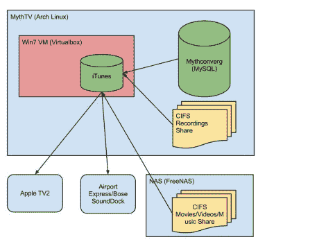

# 苹果电视上的 MythTV 图书馆没有越狱

> 原文：<https://hackaday.com/2012/08/02/mythtv-library-on-apple-tv-without-a-jailbreak/>

[Dan]来信分享了一个链接，链接到他的 MythTv 到 Apple TV 设置。他找到了一种方法，可以在第二代苹果电视上播放他在 Linux 盒子上录制的视频。我们首先想到的是他会在越狱设备上使用 [XBMC，但事实并非如此。秘诀在于将 iTunes 融入其中。](http://hackaday.com/2011/01/21/our-beloved-xbmc-hits-ios-devices/)

看一下上面的图表。该系统从运行 MythTV 的 Arch Linux 机器开始，MythTV 是一个开源程序，允许你从调谐器或编码器硬件进行录制。但是实际上在 iOS 设备上观看这些录像是很困难的，原因有几个。首先，苹果喜欢把他们的设备锁得紧紧的，希望你买你的娱乐节目，而不是看无线唱片。其次，如果你在录制 ATSC 频道，文件可能是 1080i 或 1080p，这两种格式都不能被 Apple TV 2 处理。[Dan]首先使用手刹的命令行版本将记录代码转换为 h264 格式，从而解决了这个问题。然后，他使用运行在 Windows 7 虚拟机(在 Linux 机器上)上的 iTunes 将转码后的文件存储在苹果电视可以访问的库中。