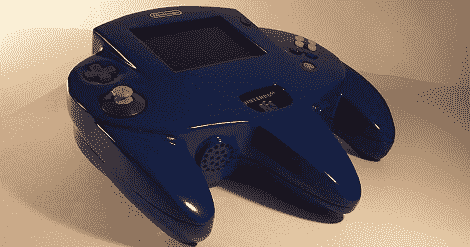

# N64 控制器中的 N64

> 原文：<https://hackaday.com/2012/06/21/n64-in-an-n64-controller/>

我们以前见过便携式 N64，但没有一个达到[Bungle]的[超大 N64 控制器](http://www.made-by-bacteria.com/viewtopic.php?f=20&t=1646) casemod 的水平。

不同于我们在其他案例中常见的“打磨 Bondo 和粘合苯乙烯”的方法，[Bungle]决定用阳模制作一个[硅胶模具。[Bungle]不仅最终得到了一个与工厂生产的东西没有什么区别的外壳，而且成型过程给他留下了更多的内部空间，并有能力制作他的超大控制器的相同副本。](http://www.made-by-bacteria.com/viewtopic.php?f=18&t=1201&start=40)

电子产品是标准配置——一款稍微改进的 N64，带有 PSone 液晶显示屏。因为隆隆声和内存包内置于巨大的控制器的主体中，[Bungle]增加了一个多功能 pak，以提供电源、亮度控制、a/v 和第二个控制器的端口。

这是一个惊人的建设，真正加强了游戏机改装游戏。休息之后你可以看看[Bungle]的演示视频。

[https://www.youtube.com/embed/Mq8_T4CUV1c?version=3&rel=1&showsearch=0&showinfo=1&iv_load_policy=1&fs=1&hl=en-US&autohide=2&wmode=transparent](https://www.youtube.com/embed/Mq8_T4CUV1c?version=3&rel=1&showsearch=0&showinfo=1&iv_load_policy=1&fs=1&hl=en-US&autohide=2&wmode=transparent)

感谢[Raizer04]送来这封信。