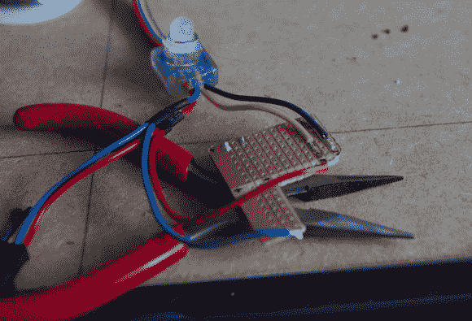

# NASA 启发的昼夜节律灯

> 原文：<https://hackaday.com/2013/02/08/nasa-inspired-circadian-rhythm-lights/>

在阅读了美国国家航空航天局和波音公司为国际空间站开发灯光的计划后,[Rasathus]决定尝试建造自己的灯光。该项目使用 [RGB 像素构建一个昼夜节律灯装置](http://rasathus.blogspot.co.uk/2013/01/circadian-lighting-part-one.html)。没有太阳的正常升起和落下，宇航员的睡眠时间表会相当粗糙。这种方法按照明确的时间表使用颜色和光的强度来帮助缓解这种情况。[Rasathus]正试图将他的项目控制在为国际空间站设立的 1110 万美元以下。

他使用的照明模块来自 Adafruit 的一串发光二极管。每一个都由 WS2801 控制器驱动，这是一个用于简单和复杂项目的通用驱动器[，比如我们自己的【杰西·康登】解决的这个巨大的光球](http://hackaday.com/2012/09/11/disco-planet-a-massive-rgbw-led-array-in-a-6-globe/)。上面的板是用于与 Raspberry Pi GPIO 接头接口的适配器板的开始。[Rasathus]想确保他没有烧坏控制电子设备，所以他在这个适配器中建立了一些保护。控制软件包含在[的第二部分](http://rasathus.blogspot.co.uk/2013/02/nasa-style-circadian-lighting-wrap-up.html)中。休息之后我们嵌入了那个帖子的视频。

[https://www.youtube.com/embed/Q9_tqoOkmCU?version=3&rel=1&showsearch=0&showinfo=1&iv_load_policy=1&fs=1&hl=en-US&autohide=2&wmode=transparent](https://www.youtube.com/embed/Q9_tqoOkmCU?version=3&rel=1&showsearch=0&showinfo=1&iv_load_policy=1&fs=1&hl=en-US&autohide=2&wmode=transparent)