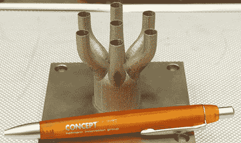

# 美国宇航局正在 3D 打印火箭发动机零件

> 原文：<https://hackaday.com/2012/11/11/nasa-is-3d-printing-rocket-engine-parts/>

如果你没有听说，美国宇航局正在建造一种新的火箭——取代航天飞机——最终将再次把宇航员带到低地球轨道之外。它被称为太空发射系统，看起来与载人登月的土星五号惊人地相似。制造技术比 60 年代中期领先了好几光年，这一次美国宇航局正在用选择性激光熔化打印一些火箭部件。

马歇尔太空飞行中心的团队正在用激光熔化金属粉末来生产用于太空发射系统地球出发阶段的新型 J-2X 发动机的部件。虽然 3d 打印部件还没有在 J-2X 的任何实弹测试中使用，但我们的目标是在今年晚些时候测试这些部件，并最终将它们用于载人，将宇航员运送到月球、小行星甚至火星。

这并不是 3d 打印第一次被用于制造火箭发动机。今年早些时候，我们看到【火箭兼职】[建造*一个完整的火箭发动机*](http://hackaday.com/2012/10/04/3d-printing-a-rocket-engine/) ，以丙烷和二氧化氮为动力，使用美国宇航局正在使用的相同技术。[兼职]的引擎非常小，小到甚至无法自行离开地面。尽管如此，看到 3D 打印最终将人们带入太阳轨道还是很棒的。