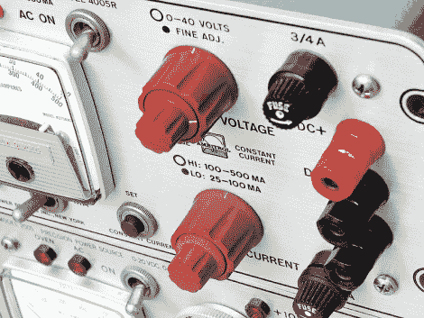

# neosporin……台式设备的 Retrobright？

> 原文：<https://hackaday.com/2012/04/17/neosporin-the-retrobright-for-bench-equipment/>

[linux-works]从易贝获得了一个旧的电源，因为它建于 60 年代或 70 年代，所以需要一点 TLC。有一件事立即引起了他的注意，那就是旋钮、刻度盘和香蕉插座的状况，它们暗淡褪色，显示出 40 多年的过度使用。

他首先简单地从电源上取下旋钮，用肥皂水彻底清洗，然后让它们风干。后来他们看起来没有任何好转，所以他决定采取不同的方法，并应用一些三重抗生素软膏到旋钮。事实证明，让药膏静置几分钟，然后用软布擦拭旋钮确实让它们发亮，正如你在上面的图片中看到的。[linux-works]将这种效果归因于该产品的白色凡士林基础，而不是抗生素，这可能使大量产品同样适合这一工作。

我们知道 Retr0bright 对老式电脑用户的效果有多好，所以我们有兴趣看看三联抗生素治疗的效果能持续多久。这当然不会伤害那些花时间在跳蚤市场寻找经典电子设备的读者(T2)。