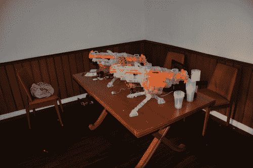

# Nerf 天启哨兵枪

> 原文：<https://hackaday.com/2012/12/28/nerf-sentry-gun-for-the-apocalypse/>

如果你曾经想用 Nerf 枪射击某人，但没有精力离开沙发，[这个技巧可能适合你](http://blog.moamindustries.com/2012/12/22/apocalypse-sentry-system/ "Nerf sentry gun")。这也是一个很好的方法来抵御僵尸，如果另一个启示，玛雅或其他，是在地平线上。

虽然效果非常酷，但正如在休息后的视频中看到的那样，制作这种设置的方法非常简单。这个项目的要求是，枪不能被永久修改，一切都必须自动发射。这些限制可能有助于设计的简单性，因为我们中的许多人会在不得不打破东西之前就开始打破它。

而不是一些精心制作的黑客，扳机被绑在发射位置。然后，继电器被用来中断该机构的电源，使配备有红外传感器的 Arduino 自动控制发射。设置在休息后解释，但如果你想看枪的动作，跳到 1:55 左右。

[https://www.youtube.com/embed/eTcF20QnxC8?version=3&rel=0&showsearch=0&showinfo=1&iv_load_policy=1&fs=1&hl=en-US&autohide=2&wmode=transparent](https://www.youtube.com/embed/eTcF20QnxC8?version=3&rel=0&showsearch=0&showinfo=1&iv_load_policy=1&fs=1&hl=en-US&autohide=2&wmode=transparent)