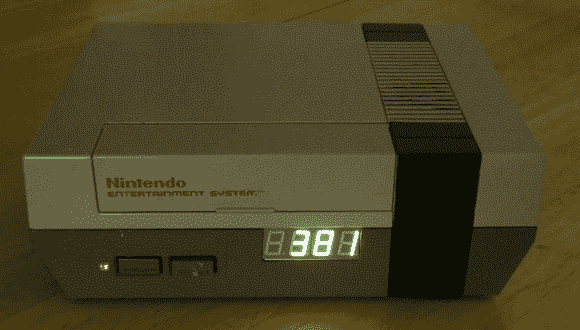

# NES 烦恼计时器在你的工作中交不到朋友

> 原文：<https://hackaday.com/2013/03/05/nes-annoyance-timer-makes-no-friends-at-your-work/>

还在努力巩固办公室怪杰的名声吗？这个项目很快就会让所有人知道你是个彻头彻尾的混蛋。叫做[8 位讨厌的人去除器](http://www.youtube.com/watch?v=QW5L2fMriZk)。当有人进入你的办公室时，它会进行检测，并开始播放《超级马里奥兄弟》的主题曲，同时显示屏会倒计时 400 秒。就像在游戏中，音乐在结束时变快，当它停止时，他们知道是时候离开了。

里面的硬件并不太复杂。一个 Arduino 和一个 Wave shield 完成了大部分工作。播放的歌曲存储在 SD 卡上，可以很容易地更改。外壳顶部的散热孔下面安装了一个扬声器。该设备默认显示一天中的时间，但会监控一侧的运动传感器，以检测何时有人进门。当有人离开时，切断音乐并重置显示器也是如此。休息之后，不要错过它的视频。

就好像这是专门为漫画家制作的一样

[https://www.youtube.com/embed/QW5L2fMriZk?version=3&rel=1&showsearch=0&showinfo=1&iv_load_policy=1&fs=1&hl=en-US&autohide=2&wmode=transparent](https://www.youtube.com/embed/QW5L2fMriZk?version=3&rel=1&showsearch=0&showinfo=1&iv_load_policy=1&fs=1&hl=en-US&autohide=2&wmode=transparent)

[通过 [Technabob](http://technabob.com/blog/2013/03/03/hacked-nes-annoying-person-remover/)