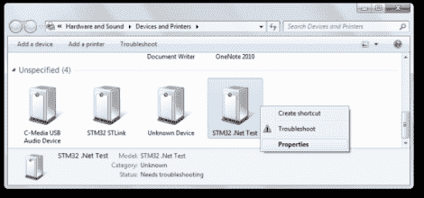

# 。用于 STM32 F4 探索板的 NET

> 原文：<https://hackaday.com/2012/10/23/net-for-the-stm32-f4-discovery-board/>

这里有一个技巧可以让你使用。STM32 发现板上的. NET 框架。[奇异工程师]很高兴得知。NET 微框架移植到 STM32 芯片上。看起来这个端口还没有达到一个稳定的版本，但是这些说明已经足够让你开始运行了。这使您可以使用 C#语言中的托管代码对嵌入式设备进行编程:STM32 F4 发现板。

将新的引导加载程序刷新到主板后，需要为 Windows 添加一个驱动程序来与之通信。上面你可以看到，董事会将枚举为' STM32。“网络测试”。安装驱动程序后，可以使用 NETMF for STM32 软件包提供的 GUI 将其余固件加载到板上。这就是准备硬件的工作，剩下的是配置 Visual Studio 以使用电路板作为目标的无痛过程。“Hello World”应用程序随后使用 C#来闪烁 LED。