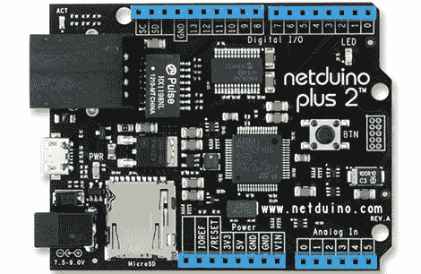

# Netduino 得到了巨大的升级

> 原文：<https://hackaday.com/2012/11/09/netduino-gets-a-huge-upgrade/>

Netduino 是一个围绕。以兼容 Arduino shields 为目标的. NET Micro framework】刚刚得到了巨大的升级。

新的 Netduino Plus 2 采用了升级的 STM32 ARM Cortex-M4 uC，运行频率为 168 MHz，在原始 Netduino 的 ARM7 运行频率为 47 MHz 的基础上进行改进。除了更强的处理能力，基于 STM32 的微控制器拥有两倍的 RAM 和六倍的闪存。此外，以太网(10Mbps)、MicroSD 卡端口以及与所有 Arduino shields 的兼容性(包括 Leonardo 的新 Arduino“Revision C”板)仍然完好无损。

为了与 Netduino 的设计目标保持一致，新板使用。运行在 Windows 下的。不过，看起来 OS X 和 Linux 用户不会被冷落太久；有一个项目是移植。网微的东西[交给单声道](http://forums.netduino.com/index.php?/topic/21-preview-of-mono-support/)。

向[Jason]致敬，感谢他送来了这个。