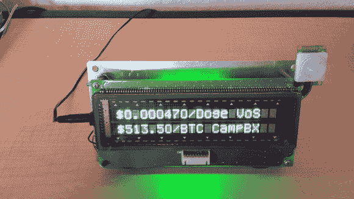

# 使用这款可编程真空荧光显示屏，您不会错过任何事情

> 原文：<https://hackaday.com/2014/05/24/never-miss-a-thing-with-this-programmable-vacuum-fluorescent-display-ticker/>

[Coyt]想要一种更便捷的方式来了解不断变化的比特币汇率，以及天气和其他有用的信息。他意识到他几年前购买的[真空荧光显示器](http://en.wikipedia.org/wiki/Vacuum_fluorescent_display "vacuum fluorescent display") (VFD)非常适合显示少量信息。

[Coyt]发现 VFD 有一个串行接口。问题是，VFD 寻找的是 12V 串行信号，但他想要使用的 Raspberry Pi 运行在 3.3V 电压下。经过仔细检查，[Coyt]发现 VFD 实际上也运行在较低的电平下，但它在主连接器前安装了一个电平转换器芯片。他简单地绕过电平转换器，然后能够让 RasPi 直接与 VFD 对话。

运行这个显示器的大脑是一个树莓派。Pi 运行一个 Python 脚本，从互联网上下载所有相关信息，并将其显示在 VFD 上。然而，库伊特并没有就此止步。他知道让屏幕一直开着有点浪费，所以他安装了一个 PIR 传感器，只在需要的时候自动打开显示屏。PIR 传感器可以检测房间内的运动，并在一段设定的不活动时间后禁用显示器。其中大部分由 LM7805 稳压器供电。虽然[Coyt]承认线性调节器不是他的理想解决方案，但它确实完成了工作。金属支架充当调节器的良好散热器。

[Coyt]也希望他的项目有一定的美感。他首先把一块金属板弯成电子设备的支架。然后，他将 VFD 安装在支架的前面，将 RasPi 安装在后面。他还在两个盘子之间安装了绿色发光二极管，照亮边缘，增加一点活力。[Coyt]认为他可以使用 RasPi 来 PWM led，但这尚未实现。这将允许他脉冲光以增加效果。

因为整个事情是由 Python 脚本运行的，所以修改它来显示其他类型的信息是微不足道的。如果你有一个运动感应自动心脏跳动器，你会做什么？