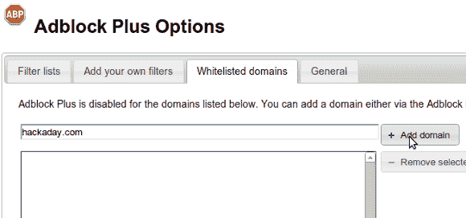

# 新广告–请将 Hackaday 列入 Adblock 的白名单

> 原文：<https://hackaday.com/2013/10/04/new-ads-please-whitelist-hackaday-on-adblock/>

如果你一直在密切关注，你可能已经注意到我们的广告已经改变。如果你不知道我们经营广告，我请你考虑在你的广告拦截浏览器插件白名单 Hackaday.com。

早在 7 月份，当 supply frame 收购 Hackaday 时，我们就提到了向更符合我们利益的广告转型的计划。我说“我们的”利益，是因为到目前为止签约的公司都是我个人在黑我自己的项目时与之有业务往来的公司。其中包括制造商:Atmel、Microchip、NXP 和德州仪器，以及分销商:Arrow Electronics、Element 14、Mouser 和 RS Components。广告和以前一样，都在同样的位置，同样的尺寸，核心理念是页面广告应该完全不引人注目。如果你发现广告与众不同，请[告诉我们](mailto:tips@hackaday.com?Subject=[Hackaday Advertising])(截图很有帮助！).

Hackaday 每天都强调稳定的项目特性流。这些是网络提供的最好的面向工程的黑客。这样做是有一些成本的，我们通过在网页上放广告来弥补。请不要屏蔽广告。如果你一直没屏蔽，谢谢！如果你使用广告拦截器，我当然理解你想远离自动播放音频、闪烁恼人的颜色或包含不适当内容的广告。我们的广告不这么做。请把我们的域名添加到您的“白名单”中，给我们一点甜头。这非常简单，休息之后，我在文章中提供了使用 Adblock Plus 完成此操作的说明。

如果你用的是 Chrome 的 Adblock Plus，浏览器地址栏的右边会有一个红色的八角形，上面有 ABP。右键单击并选择选项。上图显示了选项页面。单击“白名单域”选项卡，在框中键入“hackaday.com”，然后单击“添加域”。一定要表扬自己，因为这个小小的举动有助于支持 Hackaday。谢谢大家！