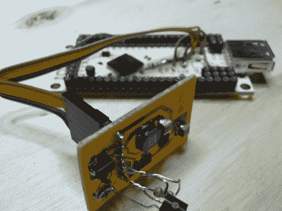

# 新的欠条正在制作中

> 原文：<https://hackaday.com/2012/05/29/new-ioio-in-the-works/>

IOIO 的新版本即将推出，我们认为你会喜欢这个重新设计的目标。如果你不熟悉，[IOIO 是一个 Android 附件板](http://hackaday.com/2011/04/07/a-breakout-board-for-your-android-phone/)。它通过 USB 连接到手机，旨在使您更容易为手持设备构建自己的硬件外围设备。只要在这里看一会儿，你会发现一堆项目都是围绕这个板构建的(例如:[给你的手机添加 MIDI 控制](http://hackaday.com/2012/02/23/control-midi-with-an-android-device/))。

随着(Ytai)宣布第二代 IOIO 正在研发中，他谈到了价格和功能的改进。当然，原板 50 美元的成本是相当低的，但如果你只是打算为傻笑而黑客，这是一个路障。虽然没有数字被引用，但计划是让新的版本更便宜。至于功能，下一代将是一个 USB 移动设备。这意味着当连接到电话上时，它可以是主设备，当连接到计算机上时，它可以是从设备。还有少量的电气设计改进。