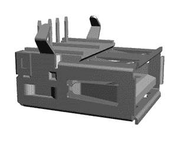

# 新零件日:三维 USB 连接器

> 原文：<https://hackaday.com/2015/01/16/new-part-day-three-dimensional-usb-connectors/>

有一个老笑话说 USB 线在三维欧几里得空间中不存在。试着把 USB 线插到插座里，第一次试总会错。翻转它，试着插入它，那也将是错误的。你只有在第三次尝试时才会成功，这证明了 USB 连接器存在于更高的现实世界中，具有神秘的几何形状。这个笑话和毕达哥拉斯学派一样古老，毕达哥拉斯学派把 USB 连接器奉为神明。

波形崩了，神亵渎了，只存在于三维空间的 USB 连接器来了。当然，我们在谈论的是一种每次都能在第一时间插入的 [a *可逆*USB A 型连接器](http://katalog.we-online.de/en/em/614_004_160_21/61400416021?m=n&sp=&sp=http%3A%2F%2Fwww.we-online.de%2Fweb%2Fen%2Felectronic_components%2Fsearchpage_PBS.php%3Fsearch%3D61400416021)。不需要电力或技术平民使用的“在电缆上寻找 USB 标志并将其正面朝上插入”的方法。

这一发现是在查看了我的每日众筹新闻稿之后，最终让我在这个愚蠢的项目上着陆。这是一根 USB 充电线，应该可以为你的手机充电两倍的速度，尽管事实上充电速度是电流的函数，这是由你从给*充电的任何东西决定的，而不是电缆。可怕的想法，但他们确实有一些有趣的东西:三维 USB 连接器。*

这种连接器不是全新的 USB 3.1 型连接器，它最终会进入手机、笔记本电脑和所有类型的可穿戴设备。这是你的标准 A 型 USB 插头，你已经知道并喜欢了十八年。这里的区别是，多年来使普通 USB 电缆不可翻转的塑料块不见了。取而代之的是一条两边都有触点的小塑料条。是的，有人花了近 20 年才发现这是一个有市场的想法。

在寻找这些三维 USB 连接器的来源时，我唯一能想到的来源是 [Wurth Elektronik](http://www.we-online.de/web/en/wuerth_elektronik/start.php) ，其中 [Farnell/Element14 带有一系列连接器](http://www.element14.com/community/docs/DOC-53747/l/all-way-pluggable-usb)，一些在 [Digikey](http://www.digikey.com/product-detail/en/614108247221/732-4345-2-ND/3908857) 上可用，一些在 [Mouser](http://www.mouser.com/ProductDetail/Wurth-Electronics/614108247221/?qs=sGAEpiMZZMulM8LPOQ%252byk56%2fAJJPTLtAGq7DE2LXED0%3d) 上可用。甚至还有一些预制的可逆电缆可用，其中 [Tripp Lite 目前处于领先地位](http://www.mouser.com/Wire-Cable/Cable-Assemblies/USB-Cables-IEEE-1394-Cables/_/N-bkrea?Keyword=reversible)。

要将其中一个连接器集成到您的产品中，只有一件事需要注意:这些插头的引出线镜像在连接器中间的塑料薄带的每一侧。这意味着你的 VCC 和 GND 引脚将紧挨着彼此，你的 D+和 D-信号引脚紧挨着彼此，现在你必须用八个引脚而不是只有四个来做你的布局。

虽然它可能不是开创性的，并且会导致一些令人困惑的 PCB 布局工作，但正如一个非常成功的众筹活动所告诉我们的那样，这可能是一个产品的真正功能。

如果你最近遇到了一个独特的、有趣的或非常酷的每个人都应该知道的组件、连接器或零件，[请在](http://hackaday.com/submit-a-tip/)中发送它，我们会看一看。