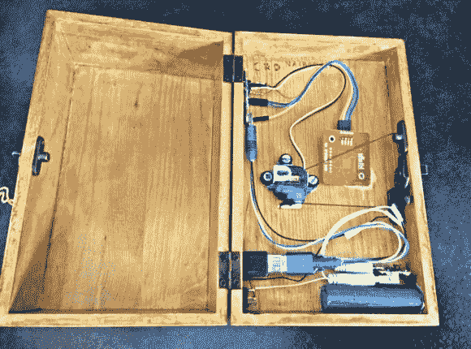

# NFC 环形锁盒

> 原文：<https://hackaday.com/2014/08/10/nfc-ring-lock-box/>

[Nairod785]想要建造一个从里面上锁的[锁箱](http://www.instructables.com/id/NFC-Ring-Lock-Box/?ALLSTEPS "NFC Ring Lock Box")。他从一个便宜的普通木箱开始。这降低了成本，但也让他可以在以后使用木材燃烧工具轻松装饰盒子。

为了锁住箱子，他在里面安装了一个简单的门闩。门闩用绳子连接到一个伺服机构。当伺服机构朝一个方向旋转时，它拉动弦并释放闩锁。当伺服系统向相反方向旋转时，插销关闭并再次锁定盒子。

如果你有一个上锁的盒子，那么你也需要一把钥匙来打开它。[Nairod785]使用了一个带有内置 NFC 标签的戒指，类似于三月份推出的戒指[。盒子里面是一个](http://hackaday.com/2014/03/17/nfc-ring-unlocks-your-phone/) [PN532 NFC 模块](http://www.elechouse.com/elechouse/index.php?main_page=product_info&cPath=90_93&products_id=2205 "PN532")。盒子的壁太厚了，读者无法发现戒指，所以[Nairod785]不得不把壁厚刮薄一点。NFC 模块连接到 Arduino Nano。与 I2C 的联系由他们处理。

NFC 环实际上有两个不同的 NFC 标签；一边一个。[Nairod785]必须将两个标签 ID 都编程到 Arduino 中，以确保戒指在任何方向都能工作。

该系统由一个可充电的 5V 小电池供电。[Nairod785]将 USB 插头与盒子壁齐平，这样他就可以在盒子锁定时轻松为电池充电。如果他愿意的话，这也允许他重新编程 Arduino。侧面还有一个电源开关以节省能量。