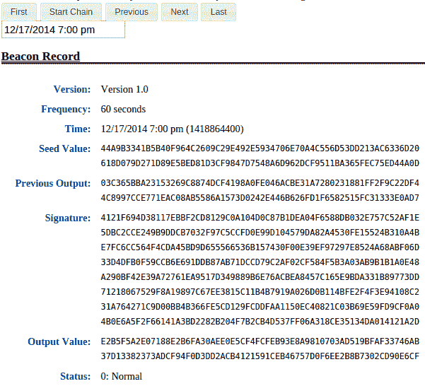
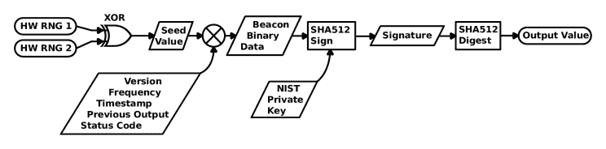
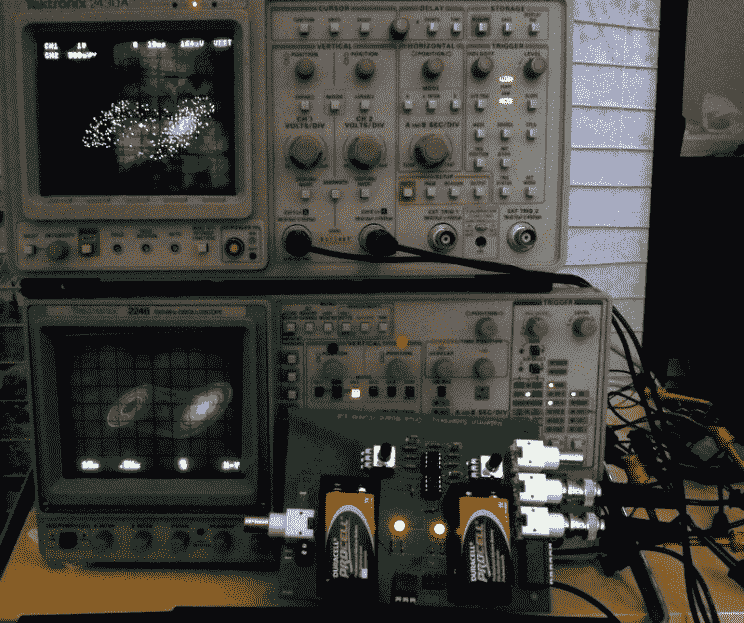

# 走向完美的掷硬币:NIST 随机性灯塔

> 原文：<https://hackaday.com/2014/12/19/nist-randomness-beacon/>

自 2013 年 9 月 5 日傍晚以来，美国国家标准与技术研究所(NIST)每天每分钟都在[发布一个 512 位全熵随机数。此外，每个数字都经过加密签名，因此您可以轻松验证它是由 NIST 生成的。这个过程中包含一个日期戳，这样您就可以知道随机值是何时创建的。最后，所有的值都链接到一个链中的前一个值，这样您就可以检测到在下一个数字发布后，序列中的任何过去的数字是否被更改过。对于一个随机值列表来说，这是一个相当广泛的特性列表，我们将在下一节讨论这个方案背后的基本原理、方法和用途，所以不要走开。](https://beacon.nist.gov/home)

但是首先，在那些脑子里有密码的人开始疯狂思考之前，请注意 NIST 有一个横幅，上面用所有的大写字母写着显而易见的内容:“警告:不要使用信标生成的值作为秘密密钥。”为什么不呢？从密码学的角度来说，它们是非凡的随机数；它们根本不是秘密！相比之下，它们对每个人都是公开的，并且永远存档。随机性信标的目的是提供一个随机数标准，而不是产生秘密。为了了解 NIST 的意图，保密和随机之间的区别是很重要的，所以现在把你的保密放在架子上。我们在这里谈论的是随机性。

## 完美的抛硬币

统计学家说，随机变量是一个函数，它产生的值在给定时间点之前是未知的，但在此之后是恒定的。意识到价值的这一瞬间对于理解随机性至关重要。这是把过去和现在分开的瞬间，过去是一段时间，在这段时间里，结果有一个围绕其可能值的概率分布，而现在的结果是一个简单的常数。

在你掷出 20 面骰子之前，从 1 到 20 的任何数字都会出现。在骰子停下来之后，绝对可以肯定的是，你刚刚掷出了一个 17，这个事实永远不会改变。你刚刚掷出了一个 17，而且仅仅是一个 17，而且是确定无疑的。概率分布已经崩溃到一个点，如果你仔细想想，这正是我们掷骰子或掷硬币的原因。当我告诉你一个简短的，完全虚构的故事时，请记住这些不确定性和时间的概念。

我妻子和我要去一家餐馆，但是我们不能决定是去意大利还是泰国。在过去的一年里，我们一直用抛硬币来决定餐馆，但自从她起了疑心，发现“随机”抛硬币根本不是随机的，而且我一直在用一枚双头硬币后，这种方法就不起作用了。她也不会接受掷骰子，原因和我们不再一起玩骰子一样。我们需要的是一次完美的抛硬币:某个未来的随机事件，其结果目前完全不可预测，我们任何一方都不可能影响，但事后很容易证实，所以没有争论的余地。

注意这里发生的事情。如果我们中的任何一个知道未来的随机值是什么，它就不是随机的了。但是我们需要更强的东西，我们甚至不能对结果做出有用的预测——硬币是公平的硬币。既然她不再信任我，我们出去吃饭的唯一方法就是我们都不能影响未来的价值。吃了一年泰国菜后，她也不会相信我会把结果读给她听，她需要自己看到结果。

[](https://hackaday.com/wp-content/uploads/2014/12/nist-randomness-beacon-screenshot.png) 这正是 NIST 提供的随机性灯塔。为了挑选一家餐馆，我们同意在晚上 7 点查看 NIST 的网页，如果第一个数字是偶数，我们就去泰国。如果是奇数，我们就去意大利。我们都同意这是公平的，因为晚上 7:00 的结果直到晚上 7:00 才公布。晚至下午 6:59，结果是完全不可知的，晚上 7:00 后，任何人都可以公开获得，并用 NIST 信标的秘密密钥散列和签名，因此很容易验证。因为信标的输出值是几个[哈希](https://en.wikipedia.org/wiki/Cryptographic_hash_function)步骤的产物，所以即使我在 NIST 有内线，我也几乎不可能提前影响这个值。即使我侵入了 NIST 的服务器并试图改变那个值，这些值链接的方式最终会使这种篡改变得明显。

虽然这对于挑选餐馆来说有点过了，但有很多类似的协议，一个公开的随机来源将有助于达成这些协议。NIST 网站上一个类似的例子是随机检查。如果破坏者提前知道哪一箱芒果将被“随机”检查，他可以在里面装满违禁品，整批货物将被扣押。或者，如果制药公司提前知道哪些病人将接受真正的药物，哪些是安慰剂，他们可以将更健康的病人分配到测试组。通过使用一个中立的随机来源，破坏者被留下来猜测，制药公司可以证明它没有在科学上作弊。或者信标可以在选举中用于随机抽样选区和重新计票的计划，不受任何政党的影响。

更深奥的是，人们可以通过包含最近的信标条目，使用随机性信标来证明某个东西比某个日期新。在我写这篇文章的时候，2014 年 12 月 31 日的值仍然悬而未决，所以我不可能写下其中的任何一个。但是从 2015 年 1 月 1 日起，这样做就变得微不足道了。因此，如果我从 12 月 31 日得到一堆用午夜价格制作的 t 恤衫，这绝对可以证明我是在新年制作的。简而言之，你可以把灯塔作为一个不老的约会计划。

## 它是如何工作的？

因此，为了了解 NIST 是如何做到这一点的，让我们快速看一下幕后的“随机性灯塔”是如何实现其目标的，即提供一个完全不可预测、极难影响且可公开验证的随机位串。概览见图 1。



很自然，这一切都始于随机数生成器。两个独立的硬件随机数发生器提供 512 位的随机性，并且这两个值被异或在一起以产生*种子值*。单独来看，这是一个非常好的 512 位随机数。

然后收集 S *eed 值*和其他相关的描述性数据:版本号、输出频率、时间戳、链接状态代码和先前输出的值。这个集合将随机结果与它的创建时间联系在一起，并将这个值与前一个值联系起来。然后收集的数据用 SHA-512 散列，并用信标的私钥签名，产生了*签名*。给定[信标的公钥](https://beacon.nist.gov/certificate/beacon.cer)，可以容易地验证签名对应于相关数据并且由信标签名。您可以使用本文底部的 UNIX shell 脚本来为您运行验证。

最后，再次用 SHA-512 对签名进行哈希运算，以创建最终的*输出值*。这是您希望用作随机数的值。它包含了这一分钟值的所有相关信息，因为它是签名的散列，而签名又是数据的散列。所有这些散列保留了来自*种子值*的原始熵，但是另外使得*输出值*以可验证的方式依赖于信标的秘密密钥和所有相关的背景数据。

## 魔鬼的辩护

现在假设你不信任 NIST。没关系，因为从设计上来说，你不需要这么做。在决定晚餐的时候，你会关心的是，这个值是不可操作的，不会影响我们是去吃泰国菜还是意大利菜。如果 NIST 内部有人想要通过选取特定的*种子值*来改变*输出值*，即使他们知道信标的密钥，在*种子值*和*输出值*之间还有两轮 SHA-512 散列。目前还不知道 SHA-512 被破坏了，所以即使是通过 SHA-512 阶段中的一个倒推基本上也是不可能的；两个回合是不可能的。


Combining NIST with your own hashes (like our One TIme Pad) creates an even more secure system than using just one source.

如果您想让结果更加难以操作，您可以使用信标中的两个值，并将它们异或或散列在一起，以创建最终的随机值。因为输出是链接的，所以改变过去的任何值都会引入改变的*先前输出*值，该值必须被向前传播到当前观察值。因此，如果你想让对手的工作变得超级困难，就把今天晚上 7:00 和昨天晚上 7:00 的*输出值*结合起来。你的对手将不得不通过 2 * 24 * 60 = 2，880 个 SHA-512 阶段向后工作，以使链验证，仍然假设他知道 NIST 的秘密密钥。

但是，假设 SHA-512 破产了，倒推起来很容易，而不是非常困难。没有什么可以阻止您编写契约来获取*输出值*，给它加 1，并通过您选择的更好的散列来运行这个值。现在，NIST 中的坏演员也必须反转您选择的哈希函数。

换句话说:操纵*输出值*实际上是不可能的，即使你的对手可以，他们也必须定制一个公开宣布的值来专门针对你。这样做的成本将是天文数字，而改变用于后处理输出值的算法的成本是微不足道的。当你开始相信一个政府标准组织内部有人为了让你吃泰国菜做了不可能的事情时，是时候重新吃药了。

我们能想到的 NIST 在制造信标时作弊的一个方法是随机种子值本身的生成和定时。想象一下*种子值*是如上所述随机生成的，但是它们是一年前而不是几秒钟前生成的。这样，NIST 的内部人士就可以在公布日期之前知道这些价值观，即使他们无法影响这些价值观，他们也可能从了解其他各方未来将做出的决定中获益。人们甚至可以利用一个已知的未来结果来构建协议。假设使用晚上 7:01 的值来选择晚餐，而不是晚上 7:00。

我们没有理由相信这正在发生，很难想象负责运行全国最精确时钟的机构还会在信标数据上贴上假时间戳。但它**是**我们能想到的系统中的一个漏洞，例如，如果灯塔的结果最终影响了股票市场，作弊的动机就会存在。

无论如何，如果你的帽子至少需要 12 层锡纸，NIST 大学的一些研究人员建议其他组织也应该运行自己的信标，以便用户可以组合来自不同机构的熵源的输出。人们可以想象在未来的世界中有多种信标源可供选择。只要你相信阴谋不会延伸到 NIST **和**你的另一个来源，你就可以确定你得到的是不可操纵的价值。问题解决了。

## 贝尔试验

这就给我们留下了真正随机性的问题。当然，硬件 RNG 得出的值看起来是随机的，但是我们是否可以发现一些潜在的确定性物理规则来预测系统的未来发展？我们的猜测是否定的，但是如果你能保证硬件会产生真正的随机性，那不是很酷吗？

[](https://hackaday.com/wp-content/uploads/2014/12/double-scroll-randomness.jpg) 

【蔡氏】双卷轴吸引子硬件用于随机数生成我们在[中看到的一个最近的特性](http://hackaday.com/2014/12/07/chaos-theory-in-practice-chuas-circuit/)。

在 [NIST 的网页](http://www.nist.gov/itl/csd/ct/nist_beacon.cfm)上，有一个未来实现的预告，它将提供有保证的非确定性随机性。一个测试贝尔不等式的实验可以产生量子力学随机的结果，并且在某个时间之前是绝对不可知的。详细介绍这个实验超出了本文的范围，但是它有点像这样:

两个[纠缠光子](https://en.wikipedia.org/wiki/Quantum_entanglement)产生并以相反的方向送出。在彼此相距足够远的位置上对每个光子进行选择和测量，使得在两次测量都完成之前，没有足够的时间让光从一个测量站到达另一个测量站。这意味着一个测量的结果不可能影响另一个，两个测量之间的高度相关性表明(随机)量子力学而不是正常的确定性物理决定了结果。另外，在光从一个测量站到达另一个测量站之前，不可能知道最终的结果。我们在一个仪器中保证了随机性和最早可知时间。

从基础物理学的角度来看，贝尔不等式和光子纠缠的真正可靠的测试很有趣，但它也是物理上不可否认的随机数的来源。建造这样一个装置也非常困难，但是他们正在努力。NIST 计划将贝尔实验的结果插入上述随机信标，然后让每个人都可以得到结果。你说你想要随机数，对吗？

## 结论

因此，简而言之，NIST 随机性灯塔被设计成一个完美的抛硬币。这是一个完全不可预测的随机值的公共来源，但也是事后可验证的，极难操纵。他们已经在公开测试中运行这项服务一年多了，我们认为现在是人们开始构思有趣的新应用的时候了。我们邀请你在下面的评论中发表你的新想法、阴谋论或任何与公共随机数相关的东西。

在我们离开随机数的主题之前，我们不禁建议看看 [Hackaday 自己的一次性密码本](http://store.hackaday.com/products/1407981609)在帖子前面的图片(0x 0f 0x 000 NUEM FAEUD POMEZRH bnr brg)或兰德 1955 年的翻页机“[一百万个随机数字与 100，000 个正常偏差](http://www.amazon.com/Million-Random-Digits-Normal-Deviates/product-reviews/0833030477/ref=cm_cr_dp_see_all_summary?ie=UTF8&showViewpoints=1&sortBy=byRankDescending)”，这是 A 级随机数的另外两个来源。只是不要使用这些资源，或 NIST 随机性信标值，来加密任何重要的秘密数据。因为它们不是秘密。

我还要感谢 NIST 的人们，他们为这篇文章提供了许多澄清和想法。特别感谢[Rene Peralta]和[John Kelsey]提供的有趣的用法想法。[Lawrence Bassham]非常详细地解释了整个信标过程，并提供了使链接和签名验证变得轻而易举的代码。尽管有他们的帮助，仍然存在的任何错误或误解都是我的。

## 附录:信标测试代码

```

## NIST Randomness Beacon verification routine
## Only slightly adapted by Elliot Williams
## from code provided by Lawrence Bassham, NIST

## The UNIX time that you'd like to test:
##
whichRecord=1400878200 

## --------------- Utility Functions ----------------

## Extracts specified record from xml file
getValue() {
 xmllint --xpath &amp;quot;/record/$1/text()&amp;quot; $2
}

## Converts little-endian to big-endian
byteReverse() {
 len=${#1}
 for((i=${len}-2; i&amp;gt;=0; i=i-2)) do
 rev=&amp;quot;$rev${1:$i:2}&amp;quot;
 done
 echo ${rev}
}

## ---------------- Get an arbitrary record -----------------
echo &amp;quot;Downloading data for: ${whichRecord}&amp;quot;
curl -s https://beacon.nist.gov/rest/record/${whichRecord} -o rec.xml

## ------------- Pack data into correct format --------------
echo
echo &amp;quot;## Create a summary of all of the data, save as beacon.bin&amp;quot;

## Strangest choice of format ever!
## Version number (ascii text)
## Update frequency (4 bytes)
## Time Stamp (8 bytes)
## The HW RNG seedValue (64 bytes)
## The previous output value, does the chaining (64 bytes)
## Status code (4 bytes)

getValue version rec.xml &amp;gt; beacon.bin
printf &amp;quot;%.8x&amp;quot; `getValue frequency rec.xml` | xxd -r -p &amp;gt;&amp;gt; beacon.bin
printf &amp;quot;%.16x&amp;quot; `getValue timeStamp rec.xml` | xxd -r -p &amp;gt;&amp;gt; beacon.bin
getValue seedValue rec.xml | xxd -r -p &amp;gt;&amp;gt; beacon.bin
getValue previousOutputValue rec.xml | xxd -r -p &amp;gt;&amp;gt; beacon.bin
printf &amp;quot;%.8x&amp;quot; `getValue statusCode rec.xml` | xxd -r -p &amp;gt;&amp;gt; beacon.bin

## ------------------ Verify signature on data --------------------

echo &amp;quot;## Verify that the signature and NIST's public key correctly SHA512 sign the data&amp;quot;

## Download Beacon's public key
echo &amp;quot;Downloading Beacon's public key&amp;quot;
curl -s https://beacon.nist.gov/certificate/beacon.cer -o beacon.cer

## Create a bytewise reversed version of the listed signature
## This is necessary b/c Beacon signs with Microsoft CryptoAPI which outputs
## the signature as little-endian instead of big-endian like many other tools
## This may change (personal communication) in a future revision of the Beacon
signature=`getValue signatureValue rec.xml`
byteReverse ${signature} | xxd -r -p &amp;gt; beacon.sig

## Pull public key out of certificate
/usr/bin/openssl x509 -pubkey -noout -in beacon.cer &amp;gt; beaconpubkey.pem
## Test signature / key on packed data
/usr/bin/openssl dgst -sha512 -verify beaconpubkey.pem -signature beacon.sig beacon.bin
echo
echo

## ------------------ Verify Signature -&amp;gt; Output and Chaining ------------
echo &amp;quot;The following three values should match: &amp;quot;
echo &amp;quot; a direct SHA512 of the extracted signature&amp;quot;
echo &amp;quot; the reported output value&amp;quot;
echo &amp;quot; next record's previous output value&amp;quot;
echo

## Just print output value
echo &amp;quot;Reported output value&amp;quot;
getValue outputValue rec.xml
echo

## Now turn the signature into the output value: again SHA512
echo &amp;quot;SHA512 of the signature&amp;quot;
getValue signatureValue rec.xml | xxd -r -p | sha512sum

## Now test chaining
## Get next record
echo &amp;quot;Downloading the next record&amp;quot;
curl -s https://beacon.nist.gov/rest/record/next/${whichRecord} -o next.xml
## Make sure that this period's output shows up as next period's &amp;quot;previous output&amp;quot;
echo &amp;quot;Next value's reported previous output (test of forward chaining)&amp;quot;
getValue previousOutputValue next.xml
echo
echo

## --------------------- The End -----------------------------------------

## If this all worked, we've verified that the signature (plus NIST's key)
## sign the hash of the random number and its support info
## _and_ we've verified that the outputValue is derived from them,
## so we know that this output value is in the chain.

## If we run this on every entry in the chain, and all works out just fine,
## then we'd know all is well

```