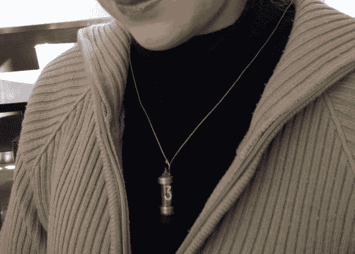

# 谢妮-ify Me 项链

> 原文：<https://hackaday.com/2014/01/17/nixie-ify-me-necklace/>

[Armilar]想要让他的朋友振作起来，他的朋友当时正经历一个艰难的时刻——她真的很喜欢柴油朋克，所以他决定为她即兴创作一张柴油朋克主题的照片。我们假设他们有其他的服装和道具，但是[Armilar]有这个想法[做一个数码管吊坠](http://electronicmercenary.wordpress.com/2014/01/04/nixieifime/)有一段时间了，他必须加快制作过程来准备好它！

考虑到所涉及的时间，他在拍摄当天设法做的事情看起来很惊人，如果不是有点不明智的话。他朋友脖子上可能有也可能没有 200 伏交流电。

他使用的电致发光驱动器额定电压为 5VDC 到 100VAC，过功率为 12VDC，产生大约 200VAC，这足以使谢妮发出一种温暖的橙色。为了尽量减小吊坠的尺寸，他不得不将电池和驱动器悬挂在项链的背面。

有点不安全，但谢天谢地拍摄顺利进行。几个月后，[Armilar]决定尝试重新设计它，这样它就可以经常佩戴，而不用担心触电。

他发现，你可以使用占空比约为 50%的闪光灯变压器来减少它发出的呜呜声。他发现的那个比他的指甲还小，这意味着他也可以把它设计到吊坠里。他的新挂件(虽然还没有完全完成)现在只有 3.5V 的电压绕在他的脖子上。

200 伏交流电不会对 T1 造成太大伤害，对吗？