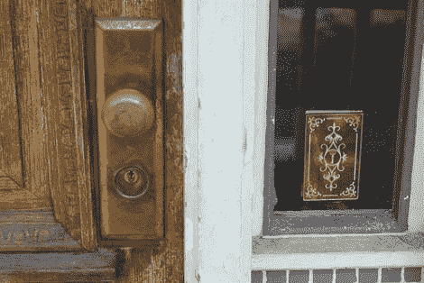

# 不需要秘密敲门——你的地铁通行证就可以了

> 原文：<https://hackaday.com/2012/08/22/no-secret-knocks-required-at-steves-house-your-subway-pass-will-do/>

[Steve]经常接待各种各样的客人，他正在寻找一种简单的方法让他的朋友们来去自由。在发现他的前门安装了电子门锁后，他决定用 RFID 阅读器来控制什么时候谁可以进来。

给你所有的朋友发 RFID 卡并期望他们带着这些卡有点夸张，但幸运的是，他住在波士顿附近，所以 MBTA 会保护他。镇上几乎每个人都有 RFID 地铁通行证，这很大程度上保证了[史蒂夫的]同伴路过时会带着一张。

他制作了一套时尚的木箱，里面装有 RFID 阅读器和控制系统的 Arduino，将它们与他家的维多利亚风格相匹配。一个按钮就可以控制设置，让他可以毫不费力地在访问列表中添加和删除卡片。然而，为了更精细的控制，[Steve]总是可以从 Arduino 串行控制台调整设置。

卡片系统既时尚又实用——这是一个无可匹敌的组合。