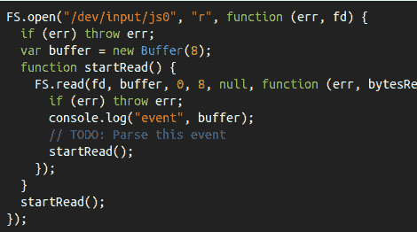

# Linux 游戏杆的 Node.js

> 原文：<https://hackaday.com/2012/08/04/node-js-for-linux-joysticks/>

[Tim Caswell]长期以来一直使用游戏手柄和操纵杆来展示他的 node.js 黑客技术。事情是这样的，他一直依靠 C++绑定来处理硬件，同时试图预示 node.js 的好评，为什么不去掉中间人，[在 node.js](http://nodebits.org/linux-joystick) 中编写一个操纵杆驱动程序呢？事实证明这很简单，任何人都可以做。

当然，这是*而不是*一个内核驱动。他依靠 Linux 内核来识别硬件，并为他提供常用的/dev/js0 文件，然后他就可以使用该文件了。正如你在上面的代码片段中看到的，他在代码中循环，以便不断地从硬件中读取数据。为了做到这一步，他翻遍了操纵杆包的文档(开源万岁！)发现每个都由一个 32 位时间戳、一个 16 位值和两个标识事件类型和按钮或轴的 8 位数字组成。

一旦他拿到包裹，就可以去比赛了。每种数据类型都被解析成一个适当的变量，您可以在自己的程序逻辑中使用该变量。不要紧张，这将是一个伟大的周末项目！