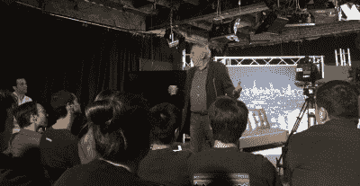

# 诺兰·布什内尔和哈卡戴在明日秀的最新一集

> 原文：<https://hackaday.com/2015/08/07/nolan-bushnell-and-hackaday-on-the-latest-episode-of-the-tomorrow-show/>

早在 6 月，当哈卡戴参加洛杉矶技术日时，我遇到了格雷布莱特。他多年来一直是 Hackaday 的忠实粉丝，最近开始制作和主持《明日秀》(The Tomorrow Show)节目，这是一档关注科学和技术的深夜脱口秀节目。[Gray]邀请我在节目中谈论 Hackaday 和 [2015 Hackaday 奖](http://hackaday.io/prize)。

[格雷]的方法是将科学家和工程师视为新的摇滚明星。在每一集里，他都邀请了一些来自科学、技术、工程、艺术和数学(STEAM)领域的大腕，并进行一次发人深省和有趣的采访。未来记者[[Ant Simpson](http://www.antsimpson.com/)和[[SupernoVanGirl](http://supernovangirl.com/)]带来了健康的喜剧效果，现场音乐表演，所有这些都是在现场观众面前拍摄的。

七月的一个星期五晚上，在好莱坞的摄影棚里拍摄这部电视剧真是太搞笑了。我很荣幸我们的节目与传奇工程师兼企业家诺兰·布什内尔(Atari and Chuck E. Cheese's 的创始人)在同一集。[诺兰]甚至做了一个即兴站立设置时，有一个短暂的技术延迟。

你可以看完整集(折叠下方)，看看明日秀团队的滑稽动作，(诺兰)关于雅达利早期和成为(史蒂夫乔布斯)老板的轶事，以及我第一次在电视上露面传播 Hackaday 奖的消息。看到[诺兰]通过电极控制[格雷]玩“大脑乒乓”也很有趣，就像去年我们参观后院大脑一样。

[https://www.youtube.com/embed/Nod-5rWtrdY?version=3&rel=1&showsearch=0&showinfo=1&iv_load_policy=1&fs=1&hl=en-US&autohide=2&wmode=transparent](https://www.youtube.com/embed/Nod-5rWtrdY?version=3&rel=1&showsearch=0&showinfo=1&iv_load_policy=1&fs=1&hl=en-US&autohide=2&wmode=transparent)

如果你想看更多这类节目，我们鼓励你看看其他的明日秀视频，甚至[订阅 YouTube 频道](https://www.youtube.com/channel/UCWxlDg4eDy0W0HvZsp7f8-g?sub_confirmation=1)。你可以[在 Hackaday.io](https://hackaday.io/graybright) 上关注格雷。

最后，如果你在洛杉矶，你应该成为未来剧集拍摄现场观众的一部分。我与其他特别嘉宾打成一片，如天体生物学家和尤里之夜创始人[ [Loretta Whitesides](https://goo.gl/uLU2GP) ]，来自 [AIO 机器人公司的[Jens Windau](http://www.zeus.aiorobotics.com/)和 3D 打印先驱[ [Janne Kyttanen](https://goo.gl/PGSbWY) ]，加上来自 [GameFaceLabs](http://www.gamefacelabs.com/) 的[Ed Mason]让我们试试他们的超低延迟 VR 耳机。人群中甚至有几个 Hackaday.io 成员，幕后团队也很棒！这是一个有趣的夜晚。感谢明天节目的 Hackaday！

