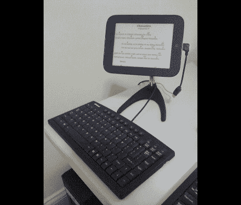

# Nook Touch 成为台式电脑

> 原文：<https://hackaday.com/2012/06/14/nook-touch-becomes-a-desktop-computer/>

看起来[Renate]已经对她的 Nook touch 进行了一次又一次的修改。多亏了一个三脚架支架，它现在可以独立站立了，这是她最近完成的作品。但是还有很多其他的修改，所有的都在休息后连接起来。

我们认为这是为了在她唱歌和演奏时显示歌词。为此，有一个脚踏板附件，让她控制设备。它通过 USB 集线器连接到 Nook，允许她一次连接多个设备。这本身也是一种黑客行为，因为主机模式不是该设备的开箱即用功能。为了避免为了给电池充电而不得不断开所有的连接，她还设法从 USB 集线器上获得了充电的东西。事实上，有了这些东西，她基本上就拥有了一台台式电脑。

三脚架式坐骑:[http://forum.xda-developers.com/showthread.php?p = 26880178 # post 26880178](http://forum.xda-developers.com/showthread.php?p=26880178#post26880178)
USB 主机模式:[http://forum.xda-developers.com/showthread.php?t=1457971](http://forum.xda-developers.com/showthread.php?t=1457971)供电集线器:[http://forum.xda-developers.com/showthread.php?p = 22956658 # postst 22956658](http://forum.xda-developers.com/showthread.php?p=22956658#postst22956658)
脚踏板:[http://forum.xda-developers.com/showthread.php?p=27391128#post27391128](http://forum.xda-developers.com/showthread.php?p=27391128#post27391128)

[via [XDA 开发者](http://www.xda-developers.com/android/nook-touch-desktop-conversion/)