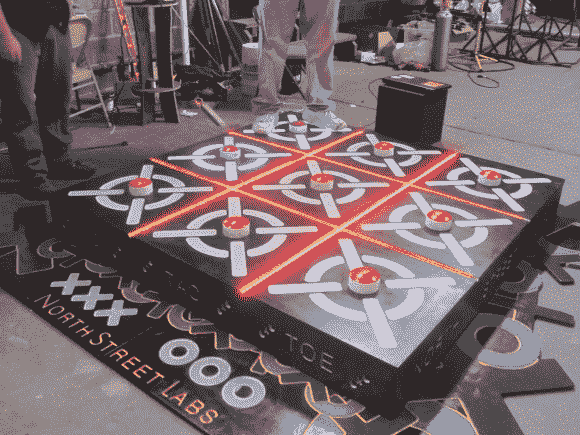

# 北街实验室试图给井字游戏增添趣味

> 原文：<https://hackaday.com/2013/05/18/north-street-labs-try-to-spice-up-a-game-of-tic-tac-toe/>

北街实验室的团队真的全力以赴开发了这个嘀嗒嘀嗒跺脚盒。最基本的，这是一个简单的双人游戏的 blinky 版本。但是，当你把平常很小的物品放大展示时，总会有一些额外的吸引力；[10x Arduino](http://hackaday.com/2012/10/04/wrapping-up-maker-faire-with-ben-heck-giant-arduinos-and-an-apple-lisa/)就是一个很好的例子。

该项目是 NSL 今年红牛创作大赛的参赛作品(距离上次大赛[已经一年了吧？).一个特殊的 Arduino 防护罩再次被生产出来，这一次它包含了控制 LED 灯条所必需的硬件…很多 LED 灯条。这导致了这个盒子的产生，它里面有大量的条形部件，通过用脚点击其中一个红色按钮来照亮网格。我们想象这个游戏很少在你的黑客空间使用，但是他们把它带到当地的儿童博物馆炫耀，它在孩子们中间大受欢迎！](http://hackaday.com/2012/07/02/hack-a-days-entry-into-the-red-bull-creation-contest/)

[https://www.youtube.com/embed/qhj-2S0VwW4?version=3&rel=1&showsearch=0&showinfo=1&iv_load_policy=1&fs=1&hl=en-US&autohide=2&wmode=transparent](https://www.youtube.com/embed/qhj-2S0VwW4?version=3&rel=1&showsearch=0&showinfo=1&iv_load_policy=1&fs=1&hl=en-US&autohide=2&wmode=transparent)