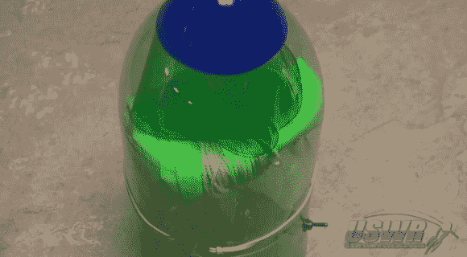

# 从汽水瓶、橡皮筋和伺服机构展开头锥降落伞

> 原文：<https://hackaday.com/2013/11/29/nose-cone-parachute-deployment-from-a-soda-bottle-rubber-band-and-servo/>

这项工程是如此简单和优雅，你会想建立一个相当严重的水火箭，只是为了让你可以尝试它。这是[一个自动降落伞展开系统](http://www.youtube.com/watch?v=vqTKXXpD9IU),你把它安装在火箭的前锥体上。该建筑的主要部分由塑料汽水瓶(2 升大小)制成，最终形成一个储存滑槽的腔室，以及一个将东西固定在一起的摩擦接头。

休息后的视频展示了如何建立一个完整的教程。它首先在瓶壁上描绘出一个类似正弦波的图案。沿着这条线切割后留下的交错榫舌构成了摩擦接合处。在瓶子底部粘上一个圆锥体(蓝色的东西)后，它接收降落伞，然后滑到另一个构成火箭主体的瓶子上。橡皮筋缠绕在机箱的外部，将这些塑料舌固定在适当的位置。橡皮筋松散的一端钩住伺服电机的喇叭，然后可以远程触发，或使用您选择的传感器。甚至还有一个由一圈塑料瓶制成的弹簧——你可以在上图中看到它就在滑槽的顶部。

需要一个像降落伞系统一样花哨的发射系统吗？给你。

[https://www.youtube.com/embed/vqTKXXpD9IU?version=3&rel=1&showsearch=0&showinfo=1&iv_load_policy=1&fs=1&hl=en-US&autohide=2&wmode=transparent](https://www.youtube.com/embed/vqTKXXpD9IU?version=3&rel=1&showsearch=0&showinfo=1&iv_load_policy=1&fs=1&hl=en-US&autohide=2&wmode=transparent)