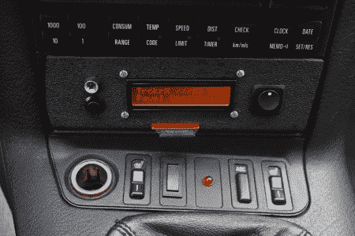

# OBD-II TrckrX:宝马 E36 M3 中的数据记录

> 原文：<https://hackaday.com/2012/04/25/obd-ii-trckrx-data-logging-in-a-bmw-e36-m3/>

[Bruce Land]在康奈尔大学为 ECE 4760 提交了这个很酷的最终项目。它被称为 TrckrX，是一个内置在宝马 E36 M3 中的 [OBD-II 跟踪和数据记录系统。有问题的汽车正在一些越野比赛中使用。这位司机想要即时访问一些数据，以及所有事情的日志，以供以后分析。该装置可实时显示车速、冷却液温度和转速。重力和时间戳存储在 SD 卡上。](http://people.ece.cornell.edu/land/courses/ece4760/FinalProjects/s2012/ppv5/index.html)

我们认为这是一个非常酷的想法，在某些情况下可能非常有用。速度和转速的实时显示似乎有点奇怪，因为汽车的速度表和转速表更适合实时信息。然而，我们完全理解这是一个课堂项目，这个人可能不想用一个新的读数来替换他们的仪表盘。