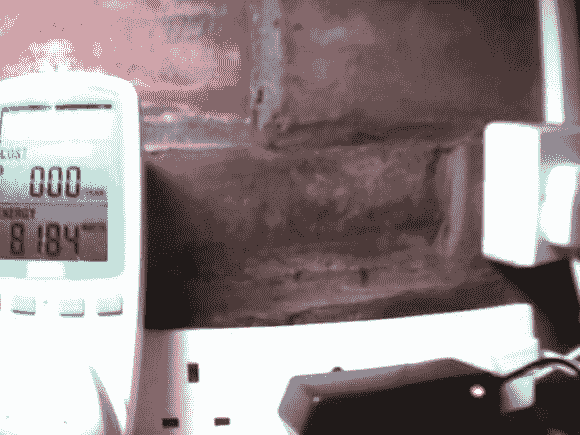

# OCR 自动读取功率表

> 原文：<https://hackaday.com/2013/01/03/ocr-automatically-reads-a-power-meter/>

[Chris]在他的服务器电源监控设备中尝试使用光学字符识别技术[。上面的图像是设置中使用的 IP 摄像机看到的。他加入了强光以确保对比度尽可能大。在对捕获的静止图像应用阈值过滤器之后，他能够处理图像来测试每个数字的所有七个片段。](http://www.anfractuosity.com/projects/ocring-a-power-meter/)

他使用 [Mathematica](http://en.wikipedia.org/wiki/Mathematica) 进行处理。我们不熟悉这种语言的细节，但很容易看出程序的主要部分。他的源代码的第六行应用了图像过滤器，然后程序遍历每个数字的指定位置，测试段组合以确定显示的是什么数字。说到小数点，事情就变得棘手了。我们推断，根据所需的总位数，电表可以显示不同程度的精度(就像数字万用表一样)。但是[Chris']设置很难可靠地检测到小数点，因为它太大了。他使用一种快捷方式来解决这个问题，因为他知道他的服务器的功率从来不会低于 300W，所以如果读数低于该基准，他就校正输出(通过乘以 10)。

当然，打开显示器以电子方式收集数据会更容易(这就是 Tweet-A-Watt 的工作方式),但那样的话，Chris 就没有玩 OCR 的乐趣了。