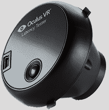

# Oculus 发布开源硬件

> 原文：<https://hackaday.com/2014/02/06/oculus-releases-open-source-hardware/>

非常酷的 Oculus Rift VR 显示器的制造商 Oculus VR 正在向开放硬件迈出第一步。他们的第一个项目是[延迟测试仪](https://www.oculusvr.com/order/latency-tester/)，旨在精确测量 VR 设置或应用的延迟。这是真正的开放硬件，固件、原理图和机械部件[都可以在 GitHub](https://github.com/OculusVR/LatencyTester) 上获得

在这个整洁的硬件内部是一个 STM32F102 微控制器和一个 TCS3414 颜色传感器。该固件被设计用来测量颜色的变化，并将数据发送回带有时间戳的计算机。

不仅有原理图和电路板文件，还有一些链接可以在奥什公园购买 PCB:大约 24 美元，你就可以得到三份送到你家门口的主 PCB 和 T2 传感器板。如果你有一台 3D 打印机， [Oculus 已经提供了。STL 文件](https://github.com/OculusVR/LatencyTester/tree/master/Mechanical)打印出该设备的附件。

虽然这是一个相当小众的产品，但我们对 Oculus folk 将这个开源硬件项目整合得如此之好感到惊讶。复制这款产品所需的一切，从电路板文件、机械设计、固件以及如何构建一切的说明都在这里，*坐在 GitHub 上。干得好。*