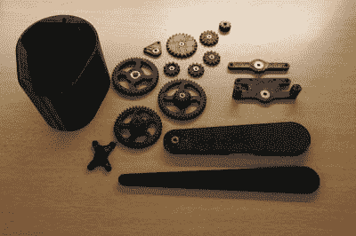

# 奇数时钟将分针移动到时针

> 原文：<https://hackaday.com/2015/05/26/odd-clock-moves-minute-hand-to-hour-hand/>

我们在 Hackaday 看到很多钟。有些很容易知道时间，有些则更神秘。[dragonator]做了一些如此简单的事情，我们很惊讶它并不常见。在典型的机械钟中，分针和时针绕着同一根轴旋转。[dragonator]决定[将分针移到时针的尖端](http://www.instructables.com/id/Hand-in-hand-clock/?ALLSTEPS)。

它的工作原理是隐藏在厚厚的时针后面的齿轮系统。时针转动时，齿轮系统转动，最后一个齿轮与分针相连。因为时针每转一圈，分针就转 12 圈，所以可以很容易地计算出传动比。

3D 打印的零件是【dragonator】自己设计的。所有的设计文件都可以在[这里](http://ytec3d.com/hand-in-hand-clock/)找到，任何人都可以造出这样一个简洁的时钟。

该时钟使用一个 Trinket 微控制器板来记录时间，并向驱动 NEMA 17 步进电机的步进杆发送步进信号。该时钟没有板载电池电源，9-12v 直流电通过壁式电源进入，并由微控制器的调节器降压至 5v。尽管如此，这仍然是一个伟大的项目，它使观看时间流逝变得有趣，休息后查看视频。

[https://www.youtube.com/embed/bowLiSlm_gA?version=3&rel=1&showsearch=0&showinfo=1&iv_load_policy=1&fs=1&hl=en-US&autohide=2&wmode=transparent](https://www.youtube.com/embed/bowLiSlm_gA?version=3&rel=1&showsearch=0&showinfo=1&iv_load_policy=1&fs=1&hl=en-US&autohide=2&wmode=transparent)