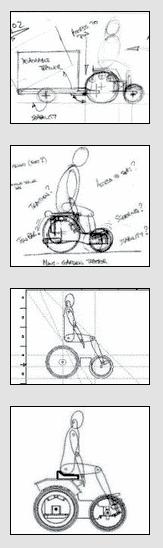

# 奇怪的迷你电动车场拖拉机是由胶合板和自行车零件

> 原文：<https://hackaday.com/2015/01/12/odd-looking-mini-ev-yard-tractor-is-made-from-plywood-and-bike-parts/>

【伊恩】喜欢制造小型电动汽车，他最独特的项目当然是这辆[庭院拖拉机](http://buggies.builtforfun.co.uk/EV3/index.php)。在项目的设计阶段，[Ian]提出了一些要求，以确保这辆车在房子周围有用。首先，它必须能在狭小的空间里灵活机动。这是通过短轴距和小直径前轮实现的。其次，它必须获得巨大的牵引力，因为把撕碎的草留在院子里是没有用的。后部的四个山地车驱动轮使牵引力加倍，同时将摩擦力分布在两倍的草地表面积上。为了进一步增加牵引力，车手的座位被故意放在后轮正上方。

通过使用胶合板作为结构构件，框架保持简单。两个 40Ah 12v 电池设置在前轴和后轴之间，为 4 个 DC 驱动电机供电。马达通过链轮和链条与轮轴相连，减速比为 36:1。这是一个很大的齿轮减速，并将拖拉机的最高速度限制在 12 公里/小时(7.5 英里/小时)。自行车轮胎前部和后部被使用，因为他们很容易获得，而且成本非常低。当然，如果没有拖车钩来牵引植物、岩石、木材或任何其他常见的庭院垃圾，拖拉机就不完整。

[Ian]在他的网站上发布了他的迷你电动拖拉机计划。如果你的孩子羡慕这台电动拖拉机，也许你可以给他做一台