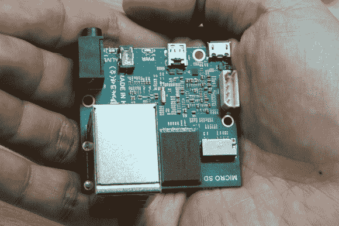

# ODROID-U2 是最新的准系统板，乞求使用

> 原文：<https://hackaday.com/2012/12/03/odroid-u2-is-latest-barebones-board-begging-to-be-used/>

哦，嘿，另一个准系统开发板。嗯，这是我们第一次看到这张照片时对自己说的话，但这种呈现方式对极客来说就像是裂缝。它从这块比信用卡还小的小板子开始。但是一旦你开始看那些附加产品，你就会想要小心，否则你会让自己流口水。

这个游戏的名字是速度。它运行的是带有 Mali-400 图形加速器的四核 Cortex-A9 芯片。没有板载存储，但 microSD 插槽旨在用于操作系统和存储。更快的选择是使用 8、16 和 64g 容量的 NAND 附加板(25-79 美元)。有一个微型 D 型 HDMI 连接器，该设备由手机充电器供电。它配有一个大散热器，作为主板的外壳。

休息后，你可以看到它启动安卓系统，并立即加载到 XBMC。菜单看起来非常简洁，让我们认为这是使用树莓 Pi 作为媒体中心的一个很好的选择。但你将为运行 Android 的更快速度和能力付出代价。他们展示的装备，加上附件，总计约 132 美元。还有硬件解码支持哪些视频格式的问题需要解答。

[https://www.youtube.com/embed/O3v0ydCG2yU?version=3&rel=1&showsearch=0&showinfo=1&iv_load_policy=1&fs=1&hl=en-US&autohide=2&wmode=transparent](https://www.youtube.com/embed/O3v0ydCG2yU?version=3&rel=1&showsearch=0&showinfo=1&iv_load_policy=1&fs=1&hl=en-US&autohide=2&wmode=transparent)

[通过 [Reddit](http://www.reddit.com/r/Android/comments/145h6o/14_ghz_quadcore_exynos_dev_boards_starting_at_69/) 和 [Engadget](http://www.engadget.com/2012/12/02/hardkernal-reveals-pair-of-quad-core-exynos-odroid-u-boards/)