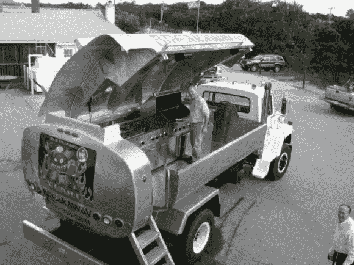

# 运油车变身巨型移动烤架

> 原文：<https://hackaday.com/2013/03/09/oil-truck-transforms-into-giant-mobile-grill/>

当卡车开过来的时候，一切看起来都很正常。这是一艘普通油轮。但是，当“2001:太空漫游”的主题开始播放，水箱的一侧开始打开时，你突然意识到事情并不像它们看起来的那样。这不仅仅是一辆油罐车，它是一个被称为“X 烤架”的巨型肉类烹饪怪物。

这辆价值 40000 多美元的怪兽的所有者和创造者[Ken Foster]与焊工[加里·韦布]合作，定制设计和制造车辆的每个部件，从铰链到液压系统。他们声称没有一个零件来自盒子。烹饪区配有扬声器和聚光灯，有储物柜、不锈钢烹饪台、四个燃烧器的炉子和 42 英寸的烤架。如果这还不够，你还可以在卡车旁边安装三个烤架，并连接到系统中。所有的设备都由安装在卡车侧面的 65 加仑的丙烷罐驱动。

虽然“X 烧烤”可以出租给私人聚会，但[Ken]说他们大部分时间都花在社区和慈善活动上。他捐赠他的设备和烹饪服务，东道主集团提供食物并获得利润。

干得好，伙计们！

[via [Neatorama](http://www.neatorama.com/)