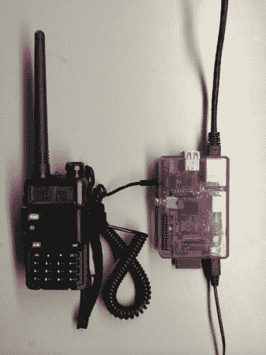

# Oinker 是火腿的 Twitter

> 原文：<https://hackaday.com/2014/05/12/oinker-is-twitter-for-hams/>

你是否曾经想通过无线方式给你的业余无线电爱好者发送一条短消息，但随后意识到你把收音机忘在家里了？[Troy]创造了 [Oinker](http://af7hg.com/oinker.html "Oinker") 来解决这个问题。Oinker 是一个 Perl 脚本，可以将电子邮件转换成音频。

该脚本监控新邮件的电子邮件帐户，然后使用 [Festival](http://www.cstr.ed.ac.uk/projects/festival/ "Festival") 文本到语音转换引擎将文本转换为音频。[Troy]在树莓 Pi 上运行 Oinker，将 Pi 的音频输出直接插入一个廉价的火腿收音机。然后，收音机被手动调谐到所需的发射频率。每当 Oinker 看到一封新邮件时，该信息就会被转换成语音，然后输出到发送器。

该脚本会自动将您的业余无线电呼号附加到每条消息的末尾，以确保您遵守 FCC 法规。现在，每当[Troy]在路上遇到交通堵塞时，他可以向他的电子邮件地址发送一条快速短信，警告他的业余无线电爱好者远离该地区。