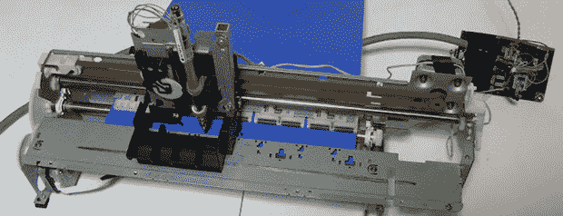

# 旧喷墨打印机变成了 SVG 绘图仪

> 原文：<https://hackaday.com/2014/03/14/old-inkjet-turned-into-an-svg-plotter/>

当你有一台旧打印机、一台便携式 CD 播放器和一些其他电子产品时，你会做什么？[当然是把它变成绘图仪](http://junkplusarduino.blogspot.jp/p/svg-image-plotter.html)。

绘图仪的框架取自老式爱普生打印机，重复使用两个步进电机沿纸张的长度和宽度移动纸张。这支笔安装在一个废弃的便携式 CD 播放器的激光头上。有了这个，只需要三个步进电机就可以让 Arduino 控制系统在纸上移动笔并放下一些标记。

本着重用的精神，打印机上的电机仍然连接到打印机的驱动板，有几根导线直接从 Arduino 连接到并行端口接口。CD 播放器中的马达是另一个考验，单个 H 桥控制笔的升降。

在软件方面，处理草图读取一个 SVG 文件，并生成一个沿路径的坐标列表。坐标的精度设置为变量，但是从下面绘图仪的视频来看，这个绘图仪的分辨率至少和笔尖一样。

[https://www.youtube.com/embed/8D1G_FwMjrk?version=3&rel=1&showsearch=0&showinfo=1&iv_load_policy=1&fs=1&hl=en-US&autohide=2&wmode=transparent](https://www.youtube.com/embed/8D1G_FwMjrk?version=3&rel=1&showsearch=0&showinfo=1&iv_load_policy=1&fs=1&hl=en-US&autohide=2&wmode=transparent)