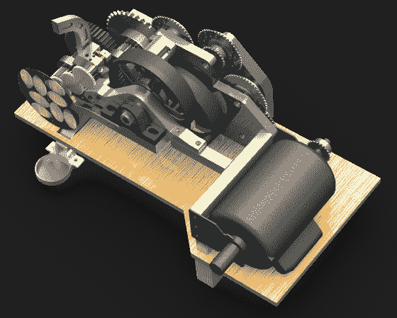

# 奥林学院便士出版社

> 原文：<https://hackaday.com/2012/12/24/olin-college-penny-press/>

受纪念品廉价印刷机的启发，[罗伯特]建造了[奥林学院廉价印刷机](http://students.olin.edu/2013/rmcmullen/penny_press.html "Olin Penny Press")。这台机器冲压出带有学校名称和各种其他图案的硬币。他把它作为机械结构课程的一部分来建造，目标是设计出使用巨大力量的东西。

压碎一枚硬币需要大约五吨的力量。为了传递这种力量，[罗伯特]使用了一个 1 马力的电机耦合到一个定制的 1190:1 减速传动系统，其中包括链轮，齿轮和链条。支撑传动系统的铝框架也必须设计成能承受巨大的力。

这需要大量的定制零件，这些零件是用数控铣床、喷水切割机和铣床制作的。所有的 CAD 绘图可供任何想要复制设计的人使用。

这台机器重约 90 磅，每分钟能压扁 12 个便士。奥林学院在校园里安装了便士印刷机，任何人都可以免费使用。