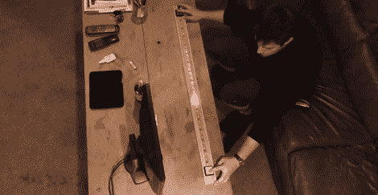

# 一维乒乓，第二次

> 原文：<https://hackaday.com/2012/11/18/one-dimensional-pong-take-two/>

为了给他 4 岁和 5 岁的侄女买一份圣诞礼物，[John]做了一个一维的乒乓游戏，在圣诞节的早晨一定会让面色红润的孩子们开心不已。

新的和改进的 1D 乒乓游戏是围绕[一个带 LPD8806 LED 控制器的数字 RGB LED 条](http://adafruit.com/products/306)构建的。“球”的速度由游戏一侧的罐子控制。随着每个玩家在正确的时间按下他们的按钮，球会反弹给另一个玩家。丢球会给对方一分，很可能会增加玩家的挫折感，大大增加游戏被扔出房间的风险。

虽然它不像[【Jason】以前的 5 米版本](http://hackaday.com/2012/08/22/one-dimensional-pong-is-a-great-use-for-led-strips/)那样是一个令人讨厌的长 1D 乒乓球游戏，但它足以让两个孩子玩几分钟以上，对于一个微控制器、按钮和一块 LED 灯来说，这是一个了不起的成就。

你可以在这个贴子中获得【John】的 AVR 代码[或者休息后查看视频。](http://pastebin.com/Z3S2bNjt)

[https://www.youtube.com/embed/m-vEJi47w0c?version=3&rel=1&showsearch=0&showinfo=1&iv_load_policy=1&fs=1&hl=en-US&autohide=2&wmode=transparent](https://www.youtube.com/embed/m-vEJi47w0c?version=3&rel=1&showsearch=0&showinfo=1&iv_load_policy=1&fs=1&hl=en-US&autohide=2&wmode=transparent)