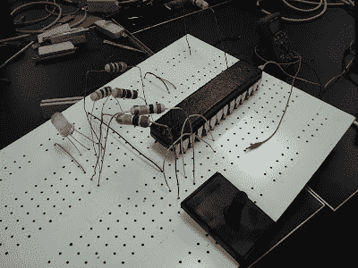

# 一块巨大的试验板

> 原文：<https://hackaday.com/2012/05/30/one-enormous-breadboard/>

[Franklyn]来信告诉我们关于[Hack Factory Big Board 项目](http://www.element14.com/community/groups/hack-factory-global-hackerspace-challenge?view=blog)的情况。位于明尼阿波利斯/圣保罗的黑客空间 Twin Cities Maker group 开始提供一种教育工具，帮助学生从原理图到面包板连接的飞跃。自然，他们的结论是创造一个巨大的 10 倍规模的面包板。该板具有按比例放大但功能齐全的电容器、电阻器、dip 开关和我们很久以来见过的最大的 led。

像其 0.1 英寸间距的对应物一样，无源元件可以放在 1 英寸间距的试验板上，以创建无数的模拟电路。双子城的人们甚至用一个按比例放大的光敏电阻拼凑了一个光学特雷门。除了模拟电路之外，该板还可以使用定制分线板展示各种 IC，该分线板具有 8 引脚 DIP 插座或真空成型的 Atmega 328，该板拥有内部 Arduino Uno。巨型 28 引脚 DIP 的酷之处在于，它不一定要充当微控制器。取而代之的是，UNO 将加载面向手边课程的芯片仿真程序，跳线选择程序来教授去抖动、逻辑、触发器和一系列其他基本概念。

我们有点担心下一个合乎逻辑的步骤是一个巨大的烙铁，但至少我们终于有东西可以连接到巨大的液晶显示器。如果你还想要更多的巨型电路，看看这个 [555 脚凳](http://hackaday.com/2011/06/30/gigantic-555-footstool/)。

跳完之后，请观看快速介绍视频！

[https://www.youtube.com/embed/jteXBscz0_M?version=3&rel=1&showsearch=0&showinfo=1&iv_load_policy=1&fs=1&hl=en-US&autohide=2&wmode=transparent](https://www.youtube.com/embed/jteXBscz0_M?version=3&rel=1&showsearch=0&showinfo=1&iv_load_policy=1&fs=1&hl=en-US&autohide=2&wmode=transparent)