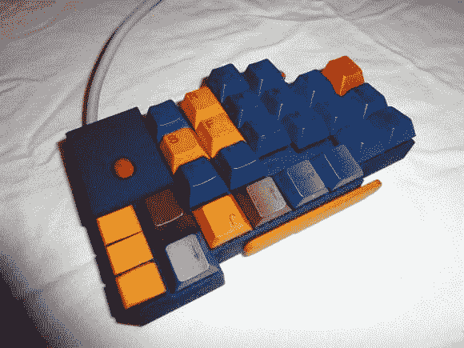

# 一个人在定制键盘开发方面的冒险

> 原文：<https://hackaday.com/2013/05/28/one-mans-adventures-in-custom-keyboard-development/>

作为一名软件开发人员，[suka]每天花大量时间在键盘前。他一直在尝试不同的键盘布局，这些布局甚至比现代晦涩的 Dvorak 布局更不常见，过了一段时间后，他决定定制一个符合人体工程学的键盘。他设计自己的定制人体工程学键盘的过程是一个引人入胜的阅读，更酷的是这些是真实的、专业品质的键盘，带有机械开关和定制外壳。

从几个 USB 数字小键盘开始，suka 通过制作他自己的翅膀式键盘进入了樱桃开关的世界。[suka]为一家大型激光烧结设备制造商工作，因此他能够相当轻松地为他的键盘和键帽制作外壳。激光烧结背后的技术让[suka]在决定使用他的日常驱动器之前，创造了一些奇怪的碗状和槽状键盘，见上图。

[suka]称之为蓝色立方体，包括一个集成支架，一个集成的 IBM trackpoint 鼠标，由一个微型控制器供电。[suka]的键盘可能不像受人尊敬的 IBM Model M 那样适合近战，但这正是[suka]想要的，对我们来说这很好。