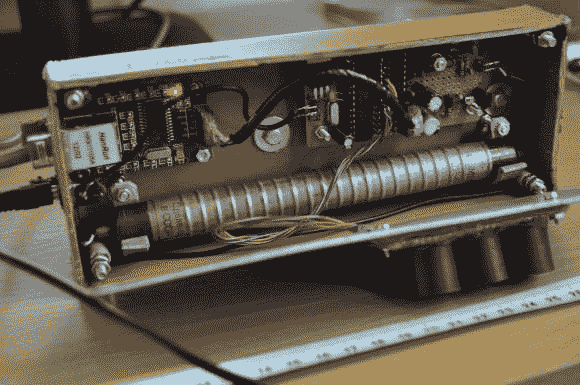

# 在线辐射监测站

> 原文：<https://hackaday.com/2012/12/07/online-radiation-monitoring-station/>

这是一个盖革计数器，它将读数显示在网页上。[Radu Motisan]花了很多时间来建设，它显示。这个东西有很多特性，硬件选择是通过几次迭代开发找到的最佳组合。

除了辐射水平，传感器单元还进行其他几项测量。这些包括温度、湿度、光度和气压。所有传感器数据都由 ATmega168 监控和收集，在 ENC28J60 以太网芯片的帮助下，这些数据可以在网页上绘制出来。这些数据的收集和显示在上面链接的帖子中有详细说明。

对于那些对硬件开发感兴趣的人，[Radu]一路上发布了许多更新。这些可以在他的论坛帖子和[的建造日志](http://www.pocketmagic.net/?p=2457)中找到。他没有任何关于他最近工作的视频，但是早在五月他就发布了一个剪辑(在休息后发现的),展示了不同盖革管的测试。

[https://www.youtube.com/embed/sJMngwBTXvw?version=3&rel=1&showsearch=0&showinfo=1&iv_load_policy=1&fs=1&hl=en-US&autohide=2&wmode=transparent](https://www.youtube.com/embed/sJMngwBTXvw?version=3&rel=1&showsearch=0&showinfo=1&iv_load_policy=1&fs=1&hl=en-US&autohide=2&wmode=transparent)

[https://www.youtube.com/embed/sJMngwBTXvw?version=3&rel=1&showsearch=0&showinfo=1&iv_load_policy=1&fs=1&hl=en-US&autohide=2&wmode=transparent](https://www.youtube.com/embed/sJMngwBTXvw?version=3&rel=1&showsearch=0&showinfo=1&iv_load_policy=1&fs=1&hl=en-US&autohide=2&wmode=transparent)